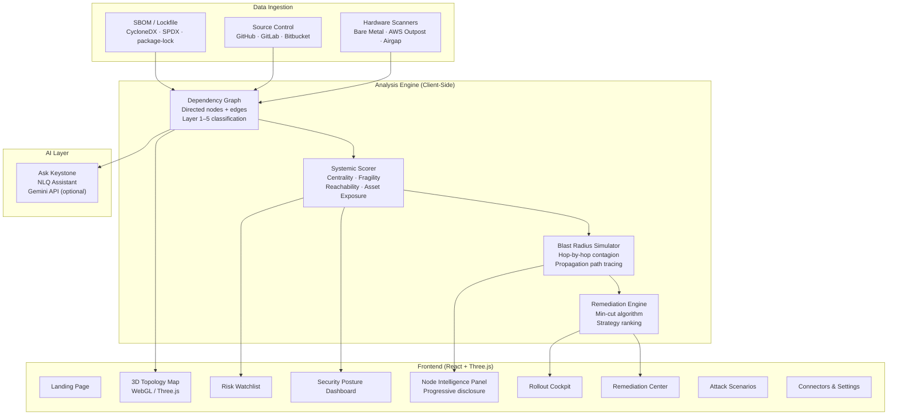

# Keystone

**Software Supply Chain Intelligence — See how dependency failures cascade before they happen.**

Keystone maps your entire dependency ecosystem as an interactive 3D graph, surfaces hidden structural chokepoints that traditional vulnerability scanners miss, simulates live compromise propagation, and prescribes the minimum change required to contain the blast radius.

[](https://react.dev)
[](https://www.typescriptlang.org)
[](https://threejs.org)
[](https://tailwindcss.com)
[](https://vitejs.dev)
[](https://ai.google.dev)

---

## The Problem

Modern software stacks contain hundreds of open-source dependencies, each pulling in transitive chains of its own. Conventional security tools score packages in isolation and produce long lists of CVEs — but they answer the wrong question.

**The real question is not "is this package vulnerable?" but "if it fails, what breaks?"**

A package with a moderate CVE score sitting at the exact point where 21 production services converge is far more dangerous than a critical CVE in a dead-code path that never executes. Without understanding the structural shape of your dependency graph, you cannot tell the difference — and neither can your existing scanner.

When a maintainer with 48 million weekly downloads steps away, when a patch release adds an unexplained binary, or when a deserialization gadget chain is confirmed in a core parsing library that touches your payment engine, you need to know the blast radius in seconds, not after an incident.

---

## What Keystone Does

Keystone ingests your dependency graph (via SBOM, lockfile, or direct repository connector) and builds a live, interactive model of your software ecosystem. It goes beyond CVE lookup in three meaningful ways:

**Structural risk scoring.** Each dependency receives a Keystone Systemic Score that weights graph centrality (betweenness percentile, reverse PageRank), maintainer fragility (bus factor, commit velocity, days since release), reachability (call-graph confirmed vs. dead code), and Tier-1 asset exposure — not just CVSS severity.

**Blast radius simulation.** Select any node and trigger a step-by-step animated compromise propagation. Watch the contagion hop from the vulnerable library through internal services and reach critical business assets in real time, so the severity is visceral and immediately communicable to any stakeholder.

**Targeted remediation.** Rather than listing everything that needs patching, Keystone computes the minimum intervention — the single coordinated upgrade that severs all propagation paths with the fewest breaking changes and lowest engineering effort. It surfaces three ranked strategies and generates a coordinated multi-repository PR plan.

---

## Key Features

| Feature | What it does | Why it matters |
|---|---|---|
| **Interactive 3D Topology Map** | WebGL force-layout graph of your full dependency ecosystem across 5 architecture layers | See structural shape at a glance — cluster, zoom, rotate, select |
| **Systemic Risk Scoring** | Per-node score combining centrality, maintainer health, reachability, and asset exposure | Ranks true impact beyond CVSS; surfaces hidden high-priority risks |
| **Compromise Simulation** | Animated, hop-by-hop propagation of a compromise from any node | Communicates blast radius in seconds to engineers and executives alike |
| **Minimum-Cut Remediation** | Graph algorithm identifies the single upgrade that severs all propagation paths | One coordinated PR instead of a sprawling remediation backlog |
| **3 Remediation Strategies** | Targeted fix (minimum cut), Quick win (low-hanging fruit), Crown-jewel protection | Different priorities for different teams and release windows |
| **Coordinated Multi-Repo PR** | Generates upgrade plan across all affected repositories with compatibility verification | Reduces coordination overhead when the same package spans dozens of repos |
| **Node Intelligence Panel** | Per-dependency deep dive: affected services, maintainer signals, SSVC verdict, VEX status | Everything needed to triage and act on a single panel |
| **Risk Watchlist** | Prioritized list of highest-risk dependencies with severity, exploitability, and action | Daily driver for security engineers to track and triage |
| **Attack Scenario Library** | Pre-built real-world compromise scenarios (supply chain backdoor, prototype pollution, maintainer anomaly) | Demo-ready walkthroughs of attack patterns tied to actual CVEs |
| **Timeline Player** | Scrub back 90 days to replay how structural risk evolved before a CVE was published | Reveals pre-CVE stealth signals invisible to point-in-time scans |
| **Role Lenses** | Three distinct perspectives: Developer (AppSec), CISO (Executive), Maintainer (Engineering) | Tailors displayed metrics and language to the audience |
| **Early Warning Signals** | Flags fresh maintainer transfers, artifact checksum drift, new hidden dependencies in patch releases | Detects supply chain anomalies before CVEs are published |
| **Evidence-Gated Rollout Cockpit** | Phased deployment pipeline with cryptographic integrity lock and soak-period gates | Prevents regression when rolling out fixes across production |
| **AI Assistant (Ask Keystone)** | Natural-language queries answered with graph-aware context (Gemini-powered when API key is set) | Ask "which dependency is most dangerous right now?" in plain English |
| **SBOM / Lockfile Ingestion** | Drag-and-drop import of CycloneDX, SPDX, and `package-lock.json` formats | Instant ecosystem analysis without connecting repositories |
| **Connectors & Integrations** | GitHub, GitLab, Bitbucket, Artifactory, Snyk, SonarQube, and more | Pull dependency graphs directly from source without manual export |
| **Hardware Scanner Nodes** | Manage bare-metal and airgapped edge scanner agents | Extend analysis into on-premise and airgapped environments |
| **Dark + Light Theme** | Full dual-theme support with a refined dark oceanic palette | Professional appearance in any environment |

---

## How It Works

```
1. Connect  →  2. Map  →  3. Score  →  4. Simulate  →  5. Fix
```

**1. Connect your ecosystem.**
Import a lockfile or SBOM (CycloneDX / SPDX / `package-lock.json`), or connect a source control integration (GitHub, GitLab, Bitbucket) to pull dependency graphs directly from your repositories.

**2. Map the dependency topology.**
Keystone builds a directed dependency graph across 5 architecture layers — from foundational open-source packages at Layer 1 up through internal libraries, platform services, business applications, and Tier-1 critical assets at Layer 5. Each node and edge is classified by runtime vs. build-time channel, SemVer lock status, and organizational ownership.

**3. Score every dependency systemically.**
Each package receives a Systemic Score computed from four factors: graph centrality (how many dependency paths flow through it), maintainer fragility (bus factor, commit activity, days since last release), reachability (whether vulnerable code paths are actually invoked), and Tier-1 asset exposure (how many critical services sit downstream).

**4. Simulate a compromise.**
Select any dependency and run the blast radius simulation. Keystone animates the hop-by-hop contagion spread across the graph — internal libraries, platform services, business applications, and ultimately your crown-jewel assets — with a live HUD showing affected service count, propagation paths, and estimated daily financial exposure.

**5. Apply the targeted fix.**
Keystone computes the minimum-cut intervention: the smallest set of changes (typically one coordinated PR) that severs all active propagation paths. It compares three strategies side by side with compatibility confidence scores, breaking change counts, CVEs resolved, and services protected. When you're ready, it generates a multi-repo PR plan with phased rollout and cryptographic integrity verification.

---

## Architecture



Keystone is a **client-side React single-page application**. All graph analysis, scoring, simulation, and rendering run entirely in the browser — no backend API is required to explore the full feature set. The application ships with a rich synthetic dependency ecosystem that demonstrates every capability out of the box.

The optional Gemini API key unlocks live natural-language queries in the Ask Keystone assistant. Without it, the assistant responds from a deterministic pre-seeded answer set.

---

## Tech Stack

| Layer | Technology | Purpose |
|---|---|---|
| **UI Framework** | React 19 | Component model, state management, routing |
| **Language** | TypeScript 5.8 | Full type safety across the entire codebase |
| **3D Rendering** | Three.js 0.185 + WebGL | Interactive dependency topology graph |
| **Styling** | Tailwind CSS v4 | Utility-first styling with dark/light theme |
| **Build Tool** | Vite 6 | Dev server, HMR, production bundling |
| **Animation** | Motion (Framer Motion) | UI transitions and panel animations |
| **Icons** | Lucide React | Consistent icon system |
| **AI Assistant** | Google Gemini (`@google/genai`) | Natural-language dependency queries |
| **Typography** | Inter · Plus Jakarta Sans · JetBrains Mono | UI and code readability |
| **Fonts** | Google Fonts | Variable weight loading |
| **Package Manager** | npm / Bun | Dependency installation |

> **No backend, no database, no infrastructure required.** The full analysis runs in the browser against a synthetic ecosystem dataset. Production deployment would integrate real lockfile parsing and SCM APIs.

---

## Getting Started

### Prerequisites

| Tool | Minimum | Verified |
|---|---|---|
| Node.js | ≥ 18.0.0 | v20.x or v25.x |
| npm | ≥ 9.0.0 | v10.x or v11.x |
| Browser | Modern evergreen | Chrome, Brave, Edge, Firefox, Safari |

> WebGL hardware acceleration must be enabled in your browser for the 3D topology map. Verify at [get.webgl.org](https://get.webgl.org/).

### Install and Run

```bash
# 1. Clone the repository
git clone https://github.com/shreyv7/keyStone.git
cd keyStone

# 2. Install dependencies
npm install

# 3. (Optional) Configure environment variables
cp .env.example .env
# Edit .env and add your Gemini API key to enable the AI assistant

# 4. Start the development server
npm run dev
```

Open **[http://localhost:3000](http://localhost:3000)** in your browser.

### Environment Variables

```ini
# .env
# Required for live AI queries in the Ask Keystone assistant.
# Without this key, the assistant uses a deterministic pre-seeded answer set.
GEMINI_API_KEY="your-gemini-api-key-here"

# Base URL where the app is hosted (default: http://localhost:3000)
APP_URL="http://localhost:3000"
```

The application is **fully functional without any API key**. All graph visualization, scoring, simulation, and remediation features work offline with the built-in synthetic ecosystem.

### Available Scripts

| Command | Description |
|---|---|
| `npm run dev` | Start dev server with HMR on `localhost:3000` |
| `npm run build` | Compile production bundle into `dist/` |
| `npm run preview` | Serve the production build locally |
| `npm run lint` | Run TypeScript type-checking (`tsc --noEmit`) |
| `npm run clean` | Remove build artifacts (`dist/`, `server.js`) |

---

## Usage

### Quick Walkthrough (2 minutes)

**Step 1 — Land and orient.**
The landing page presents Keystone's core value proposition and three ready-to-run attack scenarios. Click **"Explore Live Demo"** to enter the console directly.

**Step 2 — Security Posture overview.**
After entering, the Overview Dashboard displays the four critical metrics at a glance: critical dependencies, affected services, open risks, and recommended actions. An alert card surfaces the top 3 issues requiring immediate attention.

**Step 3 — Explore the 3D topology.**
Navigate to **Topology Map** in the sidebar. The 3D graph renders your full dependency ecosystem across five architecture layers. Click any node to open the Node Intelligence Panel — it shows the package's systemic risk score, affected services, maintainer health signals, and primary recommended action.

**Step 4 — Run a blast radius simulation.**
With a node selected, click **"Plan Targeted Fix"** → **"Simulate Compromise"**. Watch the animated hop-by-hop contagion spread from the selected dependency through internal libraries, platform services, and into Tier-1 critical assets. The HUD displays real-time counts of affected services and propagation paths.

**Step 5 — Review and apply the fix.**
After the simulation completes, click **"Plan Targeted Fix"**. The Remediation Center presents three strategies with side-by-side comparison: paths severed, breaking changes, CVEs resolved, services protected, and engineering effort. Select a strategy and click **"Apply Targeted Fix"** — the graph updates immediately to show severed edges and a clean ecosystem.

**Step 6 — Generate the coordinated PR.**
Click **"Authorize Remediation Plan"** to open the Coordinated PR modal, which generates an upgrade plan across all affected repositories with compatibility verification and a phased rollout schedule.

### Keyboard Shortcuts

| Key | Action |
|---|---|
| `?` | Toggle topology legend |
| `1` | Switch to CISO (Executive) lens |
| `2` | Switch to Developer (AppSec) lens |
| `3` | Switch to Maintainer (Engineering) lens |
| `Esc` | Close active panel or deselect node |

### Role Lenses

Three perspectives tailor the language, metrics, and priorities shown across every panel:

- **Developer (AppSec)** — Code-level impact, call-graph reachability, API compatibility, and targeted fix plans.
- **CISO (Executive)** — Business exposure, financial blast radius, service availability, and portfolio risk trends.
- **Maintainer (Engineering)** — Dependency health scores, maintainer activity, release anomalies, and phased rollout gates.

---

## Project Structure

```
keyStone/
├── src/
│   ├── App.tsx                    # Root component: routing, simulation state machine, panel orchestration
│   ├── types.ts                   # Core TypeScript types (EcosystemNode, EcosystemEdge, MitigationCandidate, ...)
│   ├── index.css                  # Global styles, Tailwind directives, semantic badge/button tokens
│   ├── main.tsx                   # React entry point
│   │
│   ├── components/                # 45+ UI components
│   │   ├── EcosystemGraph.tsx     # 3D WebGL dependency graph (Three.js, force layout, node interaction)
│   │   ├── NodeIntelligencePanel.tsx  # Per-node deep dive with 3-tier progressive disclosure
│   │   ├── OverviewDashboard.tsx  # Security posture dashboard (KPIs, risk ranking, analytics)
│   │   ├── BlastRadiusHUD.tsx     # Live telemetry HUD during compromise simulation
│   │   ├── MitigationPanel.tsx    # Fix strategy selector and apply flow
│   │   ├── RemediationPage.tsx    # Full-page remediation center
│   │   ├── RolloutCockpitView.tsx # Evidence-gated phased deployment pipeline
│   │   ├── ConnectorsPage.tsx     # Repository and tool integrations
│   │   ├── RiskWatchlist.tsx      # Prioritized dependency risk list
│   │   ├── TimelinePlayer.tsx     # 90-day risk history scrubber
│   │   ├── AskKeystone.tsx        # Natural-language AI assistant (Gemini)
│   │   ├── CoordinatedPRModal.tsx # Multi-repo PR generation workflow
│   │   ├── SBOMUploadModal.tsx    # SBOM / lockfile ingestion
│   │   ├── AuthOnboardingModal.tsx # Sign-in and onboarding wizard
│   │   ├── LandingPage.tsx        # Marketing / entry landing page
│   │   ├── HardwarePage.tsx       # Hardware edge scanner management
│   │   ├── ui/                    # Shared primitives
│   │   │   ├── PageHeader.tsx     # Consistent page title + breadcrumb component
│   │   │   ├── MetricStrip.tsx    # Horizontal KPI metric strip
│   │   │   └── Disclosure.tsx     # Progressive disclosure accordion
│   │   └── ...                    # Charts, modals, sidebar, topbar, tooltips, etc.
│   │
│   ├── data/
│   │   └── mockEcosystem.ts       # Synthetic dependency graph (23 nodes, edges, propagation paths, mitigation candidates)
│   │
│   ├── context/
│   │   └── ThemeContext.tsx        # Dark / light theme context
│   │
│   └── utils/
│       └── exportUtils.ts         # PDF/JSON report export helpers
│
├── public/
│   └── assets/                    # Connector logos, static media
│
├── index.html                     # HTML shell with font imports and meta tags
├── vite.config.ts                 # Vite + Tailwind v4 + React plugin configuration
├── tsconfig.json                  # TypeScript configuration
├── package.json                   # Scripts and dependencies
├── .env.example                   # Environment variable template
├── startup.md                     # Detailed setup and navigation guide
└── AGENTS.md                      # Development guardrails for contributors and AI agents
```

---

## Security Analysis Capabilities

These are the security analysis features **implemented** in this version:

**Structural risk identification**
- Betweenness centrality and reverse PageRank computed per node to identify graph chokepoints
- Articulation point detection (single points of failure whose removal splits the graph)
- Centrality velocity tracking (how fast a package is gaining structural importance over time)

**Vulnerability context enrichment**
- VEX (Vulnerability Exploitability eXchange) status: `affected` / `not_affected` / `under_investigation`
- SSVC (Stakeholder-Specific Vulnerability Categorization) verdict: `IMMEDIATE` / `OUT_OF_CYCLE` / `SCHEDULED` / `DEFER`
- Reachability classification: `REACHABLE` / `POTENTIALLY_REACHABLE` / `UNREACHABLE_DEAD_CODE`
- Call-graph confirmed exploit paths linking vulnerable code to Tier-1 services

**Early warning signals** (pre-CVE anomaly detection)
- Fresh maintainer transfer detection
- Artifact checksum drift (binary artifacts not matching declared source)
- Hidden transitive dependencies introduced in patch releases
- OpenSSF scorecard health tracking
- Human vs. bot commit ratio monitoring
- PDI (Package Dependency Index) scoring

**Remediation analysis**
- Minimum-cut graph algorithm to identify the minimal intervention
- Three strategy variants: minimum-cut, low-hanging fruit, crown-jewel protection
- SemVer jump classification: patch / minor / major
- Breaking change count and API compatibility confidence
- Per-strategy financial blast radius reduction estimates

**This version uses a synthetic dataset.** The algorithms, scoring models, and UI are fully implemented; production deployment would connect them to live dependency resolution and real SBOM ingestion pipelines.

---

## Roadmap

The following capabilities are planned or partially scaffolded:

- [ ] **Live SCM ingestion** — Real lockfile parsing and dependency resolution from connected GitHub/GitLab repositories
- [ ] **Real SBOM processing** — Actual CycloneDX/SPDX parsing rather than demo ingestion flow
- [ ] **CI/CD gate integration** — Block merges when a new dependency exceeds a configurable systemic risk threshold
- [ ] **Persistent user accounts** — Real authentication backend with organization-level data isolation
- [ ] **Webhook-driven graph updates** — Push-based refresh when repositories receive new commits or PRs
- [ ] **Historical trend persistence** — Store and query risk score history across time (currently in-memory scrubber only)
- [ ] **Custom scoring policy configuration** — Let teams adjust weight parameters (centrality vs. reachability vs. asset exposure) per organization
- [ ] **Expanded hardware supply chain** — Firmware and ASIC-level dependency tracking beyond the current UI scaffolding
- [ ] **Slack / PagerDuty alerting** — Push critical chokepoint alerts to existing incident response workflows

---

## Contributing

1. Read `AGENTS.md` — it defines the mandatory styling rules, color system, state machine constraints, and functional guardrails that all contributors must follow.
2. Fork the repository and create a feature branch.
3. Run `npm run lint` before committing — zero TypeScript errors required.
4. Run `npm run build` — the build must succeed with no bundling errors.
5. Verify changes in both dark and light theme.
6. Open a pull request against `main` with a clear description of what changed and why.

---

## License

No license file is currently present in this repository.

---

*Built with React, Three.js, TypeScript, and Tailwind CSS.*
