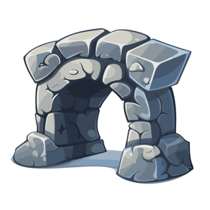
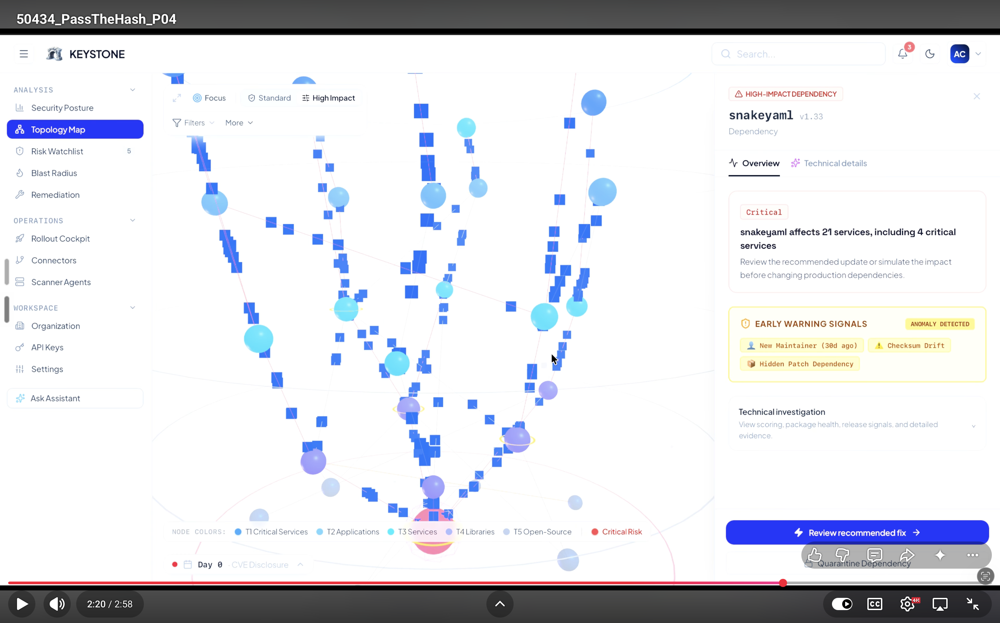
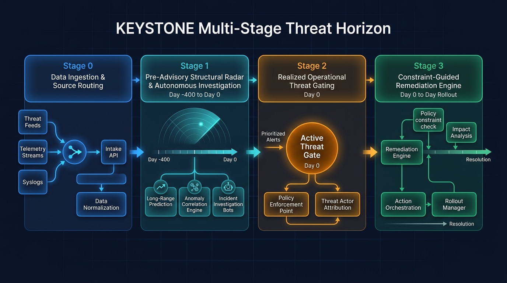
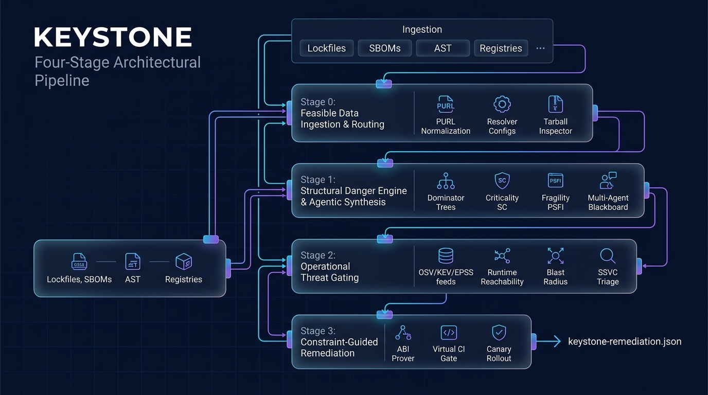
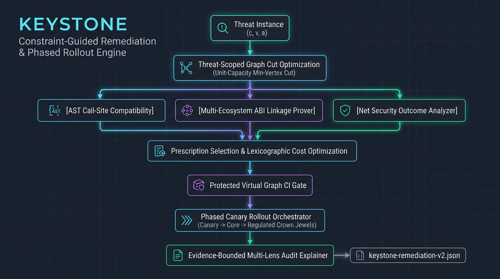
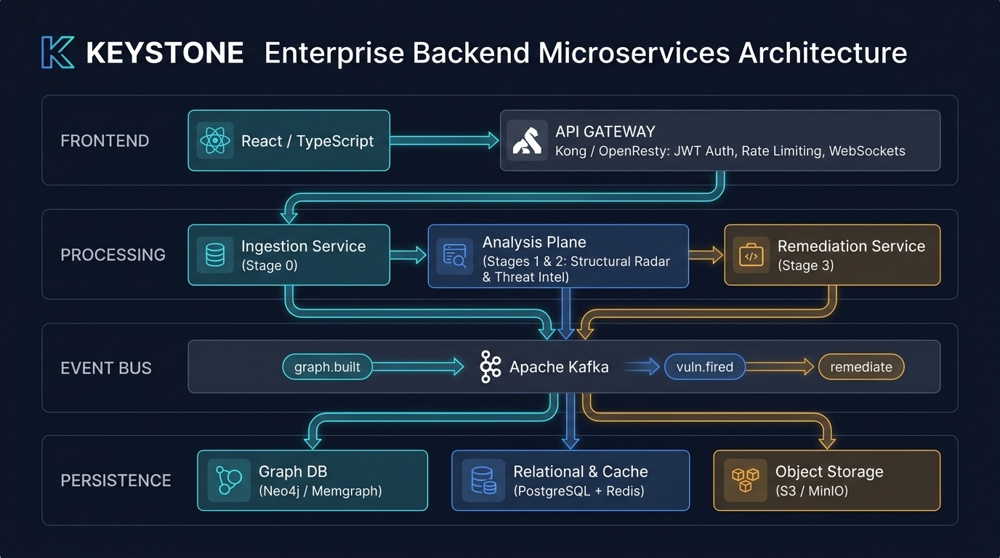
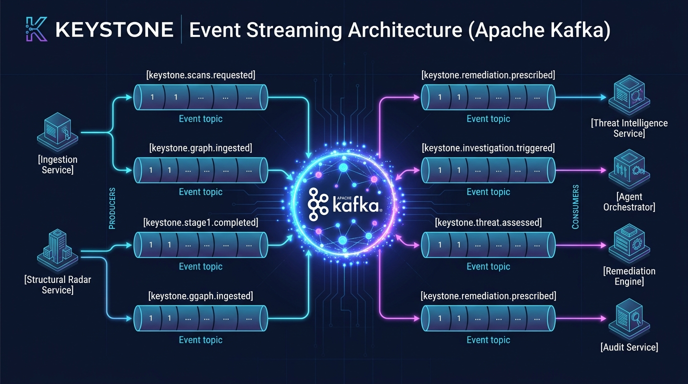
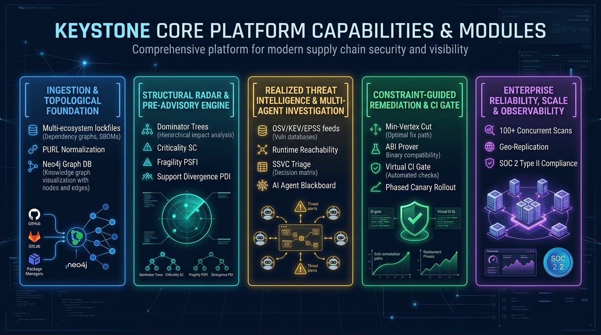

<div align="center">



# KEYSTONE
### Software Supply Chain Intelligence Platform
**Deterministic, Mathematically Grounded, CVE-Independent Supply Chain Defense**

#### 🏆 Manipal Hackathon 2026 — Track: Cybersecurity (Problem Statement 2)

[](https://key-stone-alpha.vercel.app)
[](https://youtu.be/65S1EqlpmWg)
[](https://semver.org/)
[](https://github.com/package-url/purl-spec)
[](https://cyclonedx.org/)
[](https://www.cisa.gov/stakeholder-specific-vulnerability-categorization-ssvc)
[-purple.svg)](https://csrc.nist.gov/pubs/sp/800/218/final)
[](https://slsa.dev/)

</div>

---

> [!IMPORTANT]
> ### 🏆 Manipal Hackathon 2026 — Cybersecurity Problem Statement 2
>
> **The Problem Statement:**  
> *"Modern software depends on deeply nested open-source packages, meaning a small compromise in a low-level dependency can propagate through many downstream applications. Traditional security tools often evaluate packages individually, making it difficult to understand which components are structurally important or how a compromise could spread through the wider software ecosystem. The real risk of a dependency may therefore be much greater than its own vulnerability score suggests. Design an intelligent risk-analysis system that maps relationships within a software dependency ecosystem and explores the potential downstream consequences of a compromise. The system should help identify critical dependencies, affected applications, propagation paths, and mitigation priorities while making the reasoning behind its risk assessment visible. Teams may choose how dependency relationships are modeled, how propagation is simulated, how impact is measured, and how mitigation options are ranked. Public open-source dependency information and simulated compromise scenarios may be used."*
>
> **Our Proposed Solution:**  
> **KEYSTONE** was engineered from first principles to fulfill this exact mandate. Rather than inspecting manifest files in isolation, KEYSTONE unifies an organization's cross-repository estate into a **directed property graph $G=(V, E)$**, evaluates pre-disclosure structural fragility, simulates step-by-step contagion cascades to quantify blast radius across business applications, and solves a **unit-capacity minimum vertex-cut** to prescribe surgical, non-breaking remediations with mathematically visible reasoning.

---

## 📖 Table of Contents

1. [Executive Summary: Market Landscape & Why KEYSTONE Stands Out](#-executive-summary-market-landscape--why-keystone-stands-out)
2. [Video Walkthrough & Live Demo](#-video-walkthrough--live-demo)
3. [Universal Invariants & Epistemic Laws](#-universal-invariants--epistemic-laws)
4. [The Multi-Stage Threat Horizon](#-the-multi-stage-threat-horizon)
5. [Four-Stage Architectural Pipeline](#-four-stage-architectural-pipeline)
   - [Stage 0: Feasible Data Ingestion & Source Routing](#stage-0-feasible-data-ingestion--source-routing)
   - [Stage 1: Structural Danger Engine & Autonomous Evidence Synthesis](#stage-1-structural-danger-engine--autonomous-evidence-synthesis)
   - [Stage 2: Operational Realized Threat Gating & Incident Triage](#stage-2-operational-realized-threat-gating--incident-triage)
   - [Stage 3: Constraint-Guided Remediation & Phased Rollout Engine](#stage-3-constraint-guided-remediation--phased-rollout-engine)
6. [Enterprise Backend Microservices Architecture](#-enterprise-backend-microservices-architecture)
7. [Data Architecture & Storage Topology](#-data-architecture--storage-topology)
8. [API Contracts & CI/CD Gate](#-api-contracts--cicd-gate)
9. [Interactive Frontend & 3D Topology HUD](#-interactive-frontend--3d-topology-hud)
10. [Core Platform Capabilities & Modules](#-core-platform-capabilities--modules)
11. [Observability, Reliability & SLAs](#-observability-reliability--slas)
12. [Governing Standards & References](#-governing-standards--references)

---

## 🎯 Executive Summary: Market Landscape & Why KEYSTONE Stands Out

### The Market Landscape: Why Existing Tools Fall Short

Numerous software composition analysis (SCA) scanners, automated vulnerability trackers, and dependency pull-request bots exist in today's software engineering market. While these conventional solutions are ubiquitous in enterprise CI/CD pipelines, their foundational design assumptions create critical operational blind spots:

1. **Isolated Package Auditing vs. Global Topological Reality:**  
   Traditional tools evaluate packages as isolated tabular entries against static vulnerability lists. They cannot contextualize a dependency within the larger graph. Consequently, a low-severity CVE on a high-centrality chokepoint (where 25 enterprise services converge) is routinely dismissed, while a critical CVE in dead code that is never invoked triggers false-positive emergency alerts.

2. **The "Day 0" Latency Trap (Reactive vs. Pre-Advisory Radar):**  
   Existing market tools alert solely *after* a public CVE or advisory is assigned. However, real-world supply chain crises (such as *XZ Utils*, *event-stream*, or *log4shell*) demonstrate that malicious commits, maintainer hijacking, single-developer abandonment, and anomalous binary additions incubate quietly for months (**Day −400 to Day 0**) before public cataloging. Conventional scanners offer zero pre-advisory early detection.

3. **Disruptive Bot PR Floods vs. Surgical Coordinated Remediation:**  
   When a deeply nested transitive dependency is compromised, standard market automation bots generate 30 to 50 disconnected pull requests across different repositories. This inundates development teams with merge conflicts, breaks downstream resolver dependencies (`ERESOLVE`), and causes high CI friction. They treat each repo in isolation rather than finding the single root cut that severs the attack path enterprise-wide.

4. **Black-Box Heuristics vs. Visible, Mathematically Grounded Reasoning:**  
   Many emerging tools rely on opaque proprietary risk scores or ungrounded generative AI summaries. In enterprise environments adhering to SLSA Level 3 or NIST SP 800-218, unprovable numbers and AI hallucinations cannot be audited or trusted for automated CI gates.

---

### How KEYSTONE Stands Out: A Mathematically Grounded Paradigm

KEYSTONE replaces flat checklists and uncoordinated bot PRs with rigorous graph topology, dual-channel reachability, and provable remediation:

| Dimension | Conventional Market Tools | The KEYSTONE Platform |
|---|---|---|
| **Ecosystem Modeling** | Isolated per-repository manifest parsing (flat tabular view) | Cross-repository **Directed Property Graph $G=(V, E)$** capturing multi-tier transitive flow |
| **Chokepoint Identification** | Isolated CVSS scoring of individual coordinates | **Lengauer-Tarjan Dominator Trees & Personalized PageRank** measuring structural dominance ($SC$) |
| **Threat Horizon** | Reactive **Day 0** (post-CVE advisory disclosure only) | **Pre-Advisory Topological Radar (Day −400 to Day 0)** detecting fragility, divergence, & release anomalies |
| **Reachability Analysis** | Lockfile presence (assumes all imported code executes) | **Dual-Channel Gating**: Build-runner scripts ($\chi_{\text{build}}$) vs. static AST call-graph reachability ($\tau$) |
| **Remediation Strategy** | Floods engineering teams with 40+ uncoordinated, breaking PRs | **Unit-Capacity Minimum Vertex Cut**: Prescribes 1 coordinated intervention severing all realized threat paths |
| **Compatibility Proving** | Blind version bumps (hoping unit tests pass) | **AST Call-Site & Bytecode ABI Provers** verifying non-regression and net security before release |
| **Reasoning & Auditability** | Opaque proprietary scores or generative AI summaries | **Visible Mathematical Reasoning**: Every score is grounded in graph theory and backed by SHA-256 evidence receipts |

---

## 🎥 Video Walkthrough & Live Demo

Experience the KEYSTONE platform in action — including the real-time 3D WebGL dependency topology HUD, tabletop zero-day incident simulation, and constraint-guided minimum-cut remediation:

<div align="center">
  <a href="https://youtu.be/65S1EqlpmWg" target="_blank" title="Watch KEYSTONE Platform Walkthrough on YouTube">
    
  </a>
  <br/>
  <sub><em>Click the thumbnail above to launch the walkthrough on YouTube</em></sub>
</div>

> 📺 **Watch the Full Demo on YouTube:** [https://youtu.be/65S1EqlpmWg](https://youtu.be/65S1EqlpmWg)  
> 🌐 **Interactive Live Deployment:** [https://key-stone-alpha.vercel.app](https://key-stone-alpha.vercel.app)

---

## ⚖️ Universal Invariants & Epistemic Laws

Across all subsystems, algorithms, and microservices, KEYSTONE strictly enforces foundational mathematical and security laws:

1. **The Universal Epistemic Guard:**
   $$\mathbf{UNKNOWN \ne PASS}, \quad \mathbf{UNKNOWN \ne SAFE}, \quad \mathbf{UNKNOWN \ne 0.0}$$
   Absence of evidence is never evidence of safety. Missing telemetry, unconfigured resolvers, dynamic reflection ambiguity, or missing exploitability data return explicit `UNKNOWN` / `AMBIGUOUS` states and trigger fail-closed gating.
2. **Zero Fabricated Scores & Zero Magic Constants:**
   No arbitrary weights or heuristic linear combinations are permitted. All formulas derive from discrete set theory, graph topology (dominator trees, min-vertex cuts), or recognized standards (FIRST EPSS, CVSS v3.1/v4.0, CISA KEV, SSVC).
3. **Strict Invariant Bounds (Evidence-Scope Invariant):**
   $$\text{ClaimScope}(E) \subseteq \text{ObservationScope}(E)$$
   Evidence collected for repository $R$ certifies claims *strictly and exclusively* for repository $R$. No unearned cross-application evidence inheritance is allowed.
4. **Anti-TOCTOU Exact-State Binding:**
   Every scan, threat determination, CI gate decision, and rollout dispatch is cryptographically pinned to:
   $$\text{State}(R) = \big(\text{CommitSHA}(R),\, \text{Hash}(\text{manifest}),\, \text{Hash}(\text{lockfile})\big)$$
   Any lockfile drift or commit mismatch immediately halts execution with a `STATE_MISMATCH` violation.
5. **Deterministic Validator Gate:**
   AI agents are **advisory only**. LLMs cannot emit or influence numerical risk scores. Every claim made by an agent must be backed by a SHA-256 hashed evidence object verified by a code-based deterministic validator.

---

## ⏱️ The Multi-Stage Threat Horizon

<div align="center">
  
</div>

---

## 🏗️ Four-Stage Architectural Pipeline

<div align="center">
  
</div>

---

### Stage 0: Feasible Data Ingestion & Source Routing

Stage 0 acquires, parses, normalizes, and validates repository inputs into canonical property graphs $G = (V, E)$. It computes no risk scores and applies no cuts.

- **Lockfiles & SBOMs:** Primary structural truth. Parses `package-lock.json`, `yarn.lock`, `pnpm-lock.yaml`, `pom.xml`, `Cargo.lock`, `requirements.txt`, CycloneDX v1.4–v1.6, and SPDX 2.3/3.0.
- **RFC 3986 PURL Normalization:** Normalizes every package coordinate to an immutable Package URL:
  $$\text{PURL} = \texttt{pkg:}\langle\text{ecosystem}\rangle\texttt{/}[\langle\text{namespace}\rangle\texttt{/}]\langle\text{name}\rangle\texttt{@}\langle\text{version}\rangle$$
- **Resolver Configuration Ingestion:** Parses repository `.npmrc`, `.yarnrc`, `pip.conf`, `settings.xml`, `build.gradle`, and `go.env`. If configurations are externalized in CI secrets, Stage 0 enforces $E = \text{UNKNOWN}$.
- **Source AST & Telemetry:** Ingests local source trees using Tree-sitter to identify invoked symbols and maps test suites ($E_{\text{tests}}$) and dynamic reflection points ($E_{\text{dynamic}}$).
- **Public Artifact Inspection:** Downloads tarballs (`.tgz`, `.whl`, `.jar`, `.crate`) and inspects them for install-time scripts ($CE_I$), native bindings ($CE_N$), and precompiled binaries ($CE_S$).
- **Universal Data Availability Schema:** Every node tracks whether dependencies are `AVAILABLE`, `DEGRADED`, or `UNAVAILABLE`.

---

### Stage 1: Structural Danger Engine & Autonomous Evidence Synthesis

Stage 1 operates prior to vulnerability disclosure (**Day −400 to Day 0**), evaluating the topological danger and maintainer vulnerability of components in the dependency graph.

#### Structural Criticality ($SC$) & Capability Exposure ($CE$) Engine
- **Directed Dominance Coverage ($DC_N$):** Computed using the **Lengauer-Tarjan Dominator Tree** algorithm ($O(E \cdot \alpha(V, E))$). Measures how many application paths strictly funnel through node $v$:
  $$DC(v) = \frac{|\{u \in V_{\text{dep}} \mid v \text{ dominates } u\}|}{|V_{\text{dep}}|}$$
- **Personalized PageRank ($PR_N$):** Power iteration ($d=0.85$, $K \le 50$) rooted at enterprise entrypoints.
- **Structural Criticality ($SC$):** Geometric mean of normalized dominance and PageRank:
  $$\boxed{SC(v) = \sqrt{DC_N(v) \times PR_N(v)} \in [0, 1.0]}$$
- **Capability Exposure ($CE$):** Measures installation script privilege ($CE_I$), native C/C++ bindings ($CE_N$), and shell/network capabilities ($CE_S$):
  $$CE_{\max}(v) = \max(CE_I, CE_N, CE_S) \in [0, 1.0]$$

#### Package Structural Fragility Index ($PSFI$) Analyzer
Captures the organizational difficulty of replacing or upgrading package $v$:
$$\boxed{PSFI(v) = \max\big(VLC_N(v),\, PBS(v),\, RDT_N(v),\, PMI^*(v)\big) \in [0, 1.0]}$$
1. **Version Lifecycle Exposure ($VLC_N$):** Time elapsed between package release and End-of-Life (EOL).
2. **Package Upgrade Barrier ($PBS$):** Ratio of broken client calls upon major SemVer bump.
3. **Remediation Depth Tax ($RDT_N$):** Topological shortest-path depth from application root.
4. **Pinning Monoculture Index ($PMI^*$):** Normalized Herfindahl-Hirschman index of version fragmentation across the portfolio.

#### Support Divergence & Maintainer Choke-Point Detector ($PDI$)
Identifies "log4j-style" choke points: massive architectural reliance combined with minimal maintenance support:
$$\boxed{PDI(v) = \max\big(0,\, P_S(v) - 100 \times Q_{\text{support}}(v)\big) \in [0, 100]}$$
Where $P_S(v) = 100 \times SC(v)$ and $Q_{\text{support}} = (Q_{\text{scorecard}} \times Q_{\text{velocity}} \times Q_{\text{recency}})^{1/3}$.
- **Triage:** $PDI \ge 70$ flags Critical Divergence requiring mandatory dual-vendoring.

#### Semantic Release Anomaly Engine
Detects abrupt artifact size spikes ($\Delta C^+$), unindexed native binaries, unexpected maintainer account changes, or unlinked tags without public commit correlation.

#### Organizational Adoption Expansion Tracker
Monitors the cross-application adoption velocity ($\Delta A, R_A, \Delta S, R_S$) between consecutive dependency snapshots $(t_0, t_1)$ across business domains. Cold-starts strictly emit `NO_BASELINE`.

#### Resolver Exposure & Dependency Confusion Guard
Identifies dependency confusion and internal namespace hijack risk based on package scope, private registry definitions, and external index reachability $(O, C, E, Q)$.

#### Autonomous Multi-Agent Evidence Synthesis Subsystem
For anomalous components, KEYSTONE triggers an autonomous, bounded deep-dive investigation:
- **Supervisor Agent:** Orchestrates a minimal investigation plan and enforces a strict budget: $\text{Tool Calls} \le 10$.
- **3 Specialized Worker Agents:**
  1. *Artifact Investigator:* Inspects tarballs, package hashes, and git tag signatures.
  2. *Source & CPG Investigator:* Analyzes AST/CPG slices via Tree-sitter and Semgrep.
  3. *Resolver & History Investigator:* Analyzes registry proofs and snapshot baselines.
- **Evidence Blackboard & Critic Agent:** Workers write structured findings to an append-only blackboard; the Critic agent aggressively challenges assumptions.
- **Deterministic Validator Gate:** Hard code-based gate. Every fact in the final determination must map to an immutable, cryptographically hashed evidence artifact.

---

### Stage 2: Operational Realized Threat Gating & Incident Triage

Triggered on **Day 0** by external vulnerability disclosure (OSV, NVD, CISA KEV, FIRST EPSS) or tabletop simulation.

#### Threat Activation & Synthesis ($P_{\text{active}}$)
Synthesizes active weaponization likelihood from CISA KEV and FIRST EPSS:
$$\boxed{P_{\text{active}}(v) = 1 - \prod_{c \in \text{Advisories}(v)} \big(1 - \max(I_{\text{KEV}}(c),\, \text{EPSS}(c))\big) \in [0, 1.0]}$$

#### Dual-Channel Execution Gating
Filters false positives by distinguishing between build-time and runtime threats:
1. **Build-Runner Channel ($\chi_{\text{build}}$):** Evaluates install-time scripts ($CE_I > 0$) executed in developer or CI runner environments:
   $$\chi_{\text{build}} \in \{0, 1\}$$
2. **Production-Runtime Reachability ($\tau(a, v)$):** Static interprocedural call-graph reachability traversal:
   $$\tau(a, v) = \begin{cases} 1, & \text{if } \exists \text{ path from Application Entry } a \rightsquigarrow \text{Vulnerable Symbol in } v \\ 0, & \text{if conclusively dead code / unimported} \\ 1, & \text{if dynamic reflection or timeout (fail-closed)} \end{cases}$$

#### Upstream Blast Radius & Weighted Asset Exposure
- **Application Blast Fraction ($ABF$):** Reverse BFS on transposed graph $G_R$:
  $$ABF(v) = \frac{|\{a \in V_{\text{app}} \mid v \rightsquigarrow a\}|}{|V_{\text{app}}|}$$
- **Weighted Asset Exposure ($WAE$):** Weights reached applications by their enterprise asset share $s(a)$:
  $$WAE(v) = \sum_{a \in V_{\text{app}}} s(a) \cdot \tau(a, v)$$

#### Quantitative Operational Risk Expectation ($ORE$)
$$\boxed{ORE(v) = P_{\text{active}}(v) \times I_{\text{tech}}(v) \times SC(v) \times WAE(v) \in [0, 1.0]}$$
Every $ORE$ calculation produces an immutable **Attribution Receipt** with logarithmic factor contributions ($\ln P_{\text{active}} + \ln I_{\text{tech}} + \ln SC + \ln WAE$).

#### Qualitative Triage: CISA/SEI SSVC v2.1 Deployer Tree
Maps findings directly to organizational SLAs:
- **`IMMEDIATE` (24h SLA):** Active exploit on Internet-facing Tier-1 application with Mission Failure impact.
- **`OUT_OF_CYCLE` (7d SLA):** Controlled exposure or High technical impact.
- **`SCHEDULED` (30d SLA):** Standard maintenance cycle.
- **`DEFER`:** Reachability $\tau=0$ (dead code) and no active exploit.

---

### Stage 3: Constraint-Guided Remediation & Phased Rollout Engine

The remediation engine operates across **Day 0 to Day +Rollout** to synthesize the smallest, safest, least disruptive intervention that eliminates realized threats.

<div align="center">
  
</div>

#### Remediation Pipeline Highlights:
1. **Threat-Scoped Minimum Vertex-Cut Optimization:** Finds the cut set $I$ of minimum cardinality $k^* = \min |I|$ severing all paths from application roots $S$ to vulnerable sinks $T$. Invokes native package resolvers (npm arborist, pip resolvelib, maven-resolver) to discard infeasible versions upfront.
2. **Empirical Call-Site Compatibility Analysis:** Compares application AST symbol invocations $\mathcal{S}_{\text{invoked}}$ against candidate library exports $\mathcal{S}_{\text{provided}}$. Emits `COMPATIBLE`, `MIGRATION_REQUIRED`, or `UNKNOWN`.
3. **Multi-Ecosystem ABI & Linkage Prover:** Verifies multi-ecosystem bytecode binary compatibility:
   $$E_{\text{comp}}(R) = \big(E_{\text{resolve}},\, E_{\text{linkage}},\, E_{\text{dynamic}},\, E_{\text{tests}}\big)$$
4. **Net Security Outcome & Threat Set Partitioning:** Decomposes threat impact into disjoint sets:
   $$E_{\text{removed}} = T_{\text{pre}} \setminus T_{\text{post}}, \quad E_{\text{introduced}} = T_{\text{post}} \setminus T_{\text{pre}}, \quad E_{\text{residual}} = T_{\text{pre}} \cap T_{\text{post}}$$
   - **Invariant A Gate:** Disallows introduced CVEs with $\text{CVSS} \ge 7.0$, $\text{EPSS} \ge 0.05$, or $I_{\text{KEV}} = \text{TRUE}$.
   - **Invariant B Gate:** Disallows any introduced vulnerability on Tier-1 Crown Jewel assets.
5. **Lexicographic Disruption Cost Ranking & Candidate Selection:**
   $$\boxed{r^* = \arg\min_{r \in \mathcal{F}} \big(C_{\text{change}}(r),\, C_{\text{dependency}}(r),\, C_{\text{operational}}(r)\big)}$$
6. **Protected Dependency State Guard & Virtual Graph CI Gate:** Evaluates candidate PRs on a sandboxed virtual graph $G_p$. Fails closed on regression; zero bypass backdoors.
7. **Evidence-Gated Canary Rollout Orchestrator:** Coordinates canary deployment. Binds state to commit/lockfile hashes. In the event of a change freeze, transitions safely to stateful `HELD` status with residual risk accounting.
8. **Evidence-Bounded Multi-Lens Audit Explainer:** Produces multi-lens briefings (CISO, Developer, Maintainer) with mandatory, standardized **Limitation Disclosures** separating static proofs from unproven dynamic code paths.

---

## 🏛️ Enterprise Backend Microservices Architecture

KEYSTONE backend is decomposed into **11 independently deployable microservices** running on Kubernetes.

<div align="center">
  
</div>

### Microservice Catalog

| Domain | Service | Tech Stack | Primary Responsibilities |
|---|---|---|---|
| **Platform Core** | `api-gateway` | Kong / OpenResty | Single ingress, JWT auth, rate limiting, routing, live WebSockets |
| **Platform Core** | `auth-service` | Keycloak / OIDC | Identity, RBAC (`ADMIN`, `ANALYST`, `DEVELOPER`, `AUDITOR`), Org isolation |
| **Stage 0** | `ingestion-service` | Python, FastAPI, Celery, Tree-sitter | Ingests manifests, parses lockfiles, normalizes PURLs, inspects tarballs |
| **Stage 0** | `enrichment-service` | Go, Redis, Postgres | High-throughput enrichment: deps.dev, EPSS, KEV, OpenSSF Scorecard |
| **Stage 0/1** | `graph-engine-service` | Java/Kotlin, Neo4j, gRPC | Authoritative graph DB, Lengauer-Tarjan dominators, PageRank, Min-Cut |
| **Stage 1** | `structural-radar-service`| Python, Celery, NumPy, SciPy | Computes topological danger metrics (Criticality, Fragility, Divergence) and triggers investigations |
| **Stage 1** | `agent-orchestrator-service`| Python, LangGraph, Gemini/Claude | Manages autonomous multi-agent deep investigations, Blackboard, Critic, and Validator Gate |
| **Stage 2** | `vuln-feed-service` | Go, Redis, Postgres | Real-time advisory ingestion (OSV, NVD, KEV, EPSS), PURL inverted index |
| **Stage 2** | `threat-intelligence-service`| Python, FastAPI, Celery | $P_{\text{active}}$ synthesis, build/runtime gating, reverse BFS blast radius, ORE, SSVC |
| **Stage 3** | `remediation-engine-service` | Python, Celery, Postgres | Full multi-stage remediation pipeline: min-cut optimization, ABI proofs, CI gating, and canary rollouts |
| **Support** | `notification-service` | Node.js, TypeScript | Outbound alerts: Slack, Teams, PagerDuty, SendGrid, in-app feed |
| **Support** | `audit-service` | Node.js, TypeScript, Postgres, S3 | Append-only immutable audit trail, cryptographically bound receipts |

---

## 🗄️ Data Architecture & Storage Topology

### Storage Layer Topology

- **Neo4j / Memgraph Enterprise:** Canonical property graph $G=(V, E)$ storing Application roots, Packages, Versions, and dependency edges. Pinned to `(commit_sha, lockfile_hash)`.
- **PostgreSQL 16:** Relational storage for organizations, scan jobs, structural profiles, threat assessments, remediation campaigns, and audit logs. Equipped with `pgvector` for explanation grounding.
- **Redis 7 Cluster:** Celery asynchronous task queues, PURL inverted index, and session state.
- **Apache Kafka (Strimzi):** High-throughput, distributed event bus connecting pipeline stages.
- **MinIO / AWS S3:** Immutable object storage for scanned lockfiles, raw SBOMs, tarball caches, and compliance audit archives.

### Event Streaming Architecture (Kafka)

<div align="center">
  
</div>

---

## 🔌 API Contracts & CI/CD Gate

### Core Endpoints

```
# Stage 0: Ingestion
POST   /api/v1/scans                          Initiate target repository scan
GET    /api/v1/scans/{scanId}                 Get scan execution status
GET    /api/v1/scans/{scanId}/progress        SSE live progress stream

# Stage 1: Graph & Structural Radar
GET    /api/v1/graph/{orgId}/topology         Retrieve full property graph for 3D HUD
GET    /api/v1/graph/{orgId}/node/{purl}      Detailed node feature scores
GET    /api/v1/watchlist/{orgId}              Ranked Structural Watchlist (P1, P2, P3)
GET    /api/v1/investigations/{caseId}        Autonomous case evidence & blackboard

# Stage 2: Threats & Gating
GET    /api/v1/threats/{orgId}                Active threats prioritized by ORE
GET    /api/v1/threats/{orgId}/{threatId}     Threat detail with Attribution Receipt
POST   /api/v1/threats/{orgId}/simulate       Execute tabletop attack scenario
GET    /api/v1/threats/{orgId}/ssvc           SSVC triage decision summary

# Stage 3: Remediation & Rollout
POST   /api/v1/remediation                    Generate prescription for threat_id
GET    /api/v1/remediation/{campaignId}       Campaign status & keystone-remediation-v2.json
GET    /api/v1/remediation/{campaignId}/audit Immutable audit explanation
POST   /api/v1/remediation/{id}/cohorts/promote Manual promotion gate
```

### CI/CD Gate Integration (`POST /api/v1/ci-gate/evaluate`)

Evaluates proposed Pull Requests against the virtual post-change graph $G_p$:

```json
{
  "org_id": "9b1deb4d-3b7d-4bad-9bdd-2b0d7b3dcb6d",
  "repo_id": "payment-service",
  "pr_number": 342,
  "base_commit_sha": "7f8b9e1",
  "head_commit_sha": "a1c2e3f",
  "lockfile_diff_url": "https://github.com/company/payment-service/pull/342.diff"
}
```

**Gate Response (Deterministic Enforcement):**
```json
{
  "gate_result": "BLOCK",
  "invariant_checks": {
    "no_vulnerability": "FAIL",
    "threat_severance": "PASS",
    "non_regression": "FAIL"
  },
  "violations": [
    "Candidate resolves lodash@4.17.19 which introduces CVE-2020-8203 (Prototype Pollution) into Tier-1 asset.",
    "Transitive dead-code activation: sibling dependency activates previously unreached CVE-2021-23337."
  ],
  "evaluated_at": "2026-09-17T23:55:00Z",
  "request_id": "req-98234-ci"
}
```

---

## 🖥️ Interactive Frontend & 3D Topology HUD

> 🌐 **Live Web Application:** [https://key-stone-alpha.vercel.app](https://key-stone-alpha.vercel.app)

The KEYSTONE user interface provides high-performance, real-time supply chain situational awareness:

- **Technology:** React 18, TypeScript, Vite, Tailwind CSS, Three.js, Lucide Icons.
- **3D WebGL Force-Directed Dependency HUD:** Interactive 3D visualization rendering enterprise dependency topologies with node coloring keyed by Structural Criticality ($SC$) and active threat status.
- **Top KPI Strip:** Executive visibility into Total Packages, Active Realized Threats, High-Criticality Choke Points ($SC \ge 0.70$), Average Blast Radius, and SSVC Immediate Alerts.
- **Real-Time Blast Radius HUD:** Live drill-downs into reverse-reachable application paths and financial asset shares.
- **Interactive Scenarios & Tabletop Attack Simulator:** Test hypothetical compromise events (e.g., zero-day weaponization, maintainer account takeover) and observe instant cascading graph cuts.
- **Multi-Lens Remediation Walkthrough:** Toggle between Developer, Maintainer, and CISO audit lenses with full limitation disclosure.

---

## 🛡️ Core Platform Capabilities & Modules

KEYSTONE's architecture is structured into five cohesive operational capability pillars:

<div align="center">
  
</div>

---

## 📊 Observability, Reliability & SLAs

### Platform SLA Targets

| Operational Metric | Production SLA Target | Fail-Closed / Mitigation Strategy |
|---|---|---|
| **API Gateway Uptime** | `99.9%` | Multi-AZ load balancers, active health checks |
| **Scan Latency (Medium Repo)** | `< 5 minutes` (p95) | Distributed Celery worker pool autoscaling |
| **Stage 1 Radar Latency** | `< 2 minutes` (p95) | Matrix vectorization via NumPy / graph caches |
| **Stage 2 Threat Assessment** | `< 30 seconds` post-disclosure | Inverted Redis PURL index, async Kafka dispatch |
| **Stage 3 Prescription Synthesizer**| `< 10 minutes` (p95) | Dominator tree search acceleration |
| **Autonomous Agent Investigation Budget** | `M <= 10` tool calls | Hard supervisor kill switch; deterministic timeout |
| **SSVC IMMEDIATE Alert SLA** | `< 60 seconds` to notification | Dedicated high-priority Kafka event topic |
| **CI Gate Webhook Latency** | `< 10 seconds` (p99) | Cached virtual graph resolver sandbox |

---

## 📜 Governing Standards & References

KEYSTONE strictly aligns with international cybersecurity standards and specifications:

- **SemVer 2.0.0:** Semantic Versioning specification for package compatibility evaluation.
- **RFC 3986 (PURL):** Universal Package URL specification for cross-ecosystem package identity.
- **CycloneDX v1.6 & CSAF 2.0:** Standardized Vulnerability Exploitability eXchange (VEX) formats.
- **FIRST EPSS:** Exploit Prediction Scoring System for real-world weaponization probability.
- **CISA KEV:** Known Exploited Vulnerabilities catalog.
- **CISA/SEI SSVC v2.1:** Stakeholder-Specific Vulnerability Categorization (Deployer tree).
- **NIST SP 800-218:** Secure Software Development Framework (SSDF) compliance.
- **SLSA Level 3:** Supply-chain Levels for Software Artifacts build provenance and integrity.

---

<div align="center">
  <sub>Built with mathematical rigor for resilient enterprise supply chains.</sub>
</div>
