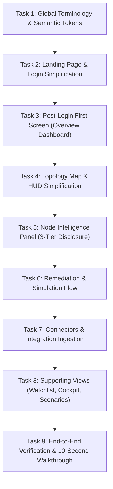

# Keystone UX Simplification & Information Architecture Overhaul

## Executive Summary & Guiding Objective
Transform the Keystone application from an information-dense, jargon-heavy prototype into a crystal-clear, executive- and hackathon-judge-friendly product. A first-time judge or technical leader must understand **within 10 seconds**:
1. **WHAT** Keystone does (Maps dependencies across repositories and identifies high-impact cascading risks).
2. **WHAT** problem it solves (Isolated vulnerability scanners miss structural single-points-of-failure and spam teams with disconnected alerts).
3. **WHAT** is currently wrong in the system (e.g., *"3 critical issues require immediate attention"*).
4. **WHAT** specific action they should take next (e.g., *"Apply targeted fix to sever all 4 attack pathways"*).

> **Core Constraint**: Do **NOT** redesign the product from scratch. Preserve Keystone's visual identity, dark oceanic aesthetic, navigation structure, 3D dependency graph, security analytics, and mathematical depth. **Remove, consolidate, hide, and prioritize** — moving deep mathematical and algorithmic proofs behind progressive disclosure ("Technical details" / "Evidence").

---

## The 12 Guiding Principles Checklist

| Principle | Guideline | Implementation Strategy |
| :--- | :--- | :--- |
| **1. Human-First Language** | Avoid internal jargon in primary UI (`F11`, `F18`, `F4`, `MIN-CUT`, `CUT-VERTEX`, `VANITY SCORE`). | Replace with plain terms: *"High-impact dependency"*, *"3 production services affected"*, *"Targeted fix"*. |
| **2. Progressive Disclosure** | 3 levels: Primary (What/Why/Action) $\to$ Secondary (Metrics/Viz) $\to$ Advanced. | Hide raw formulas, bytecode opcodes, ASTs, and RAG transcripts behind collapsible *"Technical details"*. |
| **3. Reduce Visual Competition** | Single primary CTA per section. Reduce badges, neon glows, gradients, colored borders. | Strip non-semantic badges, pulsing lights, and duplicate action buttons. |
| **4. Semantic Color System** | Dark oceanic base; green = healthy, blue = info, amber = warning, red = critical. | Remove arbitrary colors, purely decorative gradients, and rainbow status tags. |
| **5. Topology Map** | Graph communicates one primary insight. | Clear default state highlighting critical dependencies; selected panel answers 6 core questions; no overlapping HUDs. |
| **6. Security Posture** | Lead with human-readable metrics before graphs and timelines. | Top metrics: Critical dependencies, Services affected, Open risks, Recommended actions. |
| **7. Connectors** | Rename technical concepts into understandable actions. | *"Import dependency data"*, *"Repositories connected"*, *"Dependencies analyzed"*. Standards as helper text. |
| **8. Login / Landing** | Concise value proposition without algorithmic clutter. | Primary: *"See how dependency failures can spread across your organization."* Secondary: *"Map dependencies, identify high-impact risks, and plan targeted fixes."* |
| **9. Post-Login First Screen** | First screen after login answers the 4 vital questions. | Route to Overview Dashboard: *"3 issues require attention"*, listing top risks with severity, impact, and action. |
| **10. Typography Hierarchy** | Strong visual contrast between insight and supporting data. | Large = primary insight, Medium = supporting explanation, Small = metadata. |
| **11. Terminology Rule** | If not required for action, hide it behind Technical Details. | Do not remove capabilities; change visibility and placement. |
| **12. 10-Second Hackathon Test**| Complete clarity on what is wrong and what to do within 10s. | Ruthlessly prioritize high-level clarity over technical feature dumping. |

---

## Implementation Tasks Roadmap

---

### Task 1: Global Terminology, Typography Hierarchy & Semantic Token Cleanup
- [x] **Files to Modify**:
  - `src/types.ts`
  - `src/data/mockEcosystem.ts`
  - `src/components/ui/Badge.tsx`
  - `src/components/ui/Button.tsx`
  - `src/components/ui/Card.tsx`
  - `src/index.css`
- [x] **Objective**:
  - Eliminate internal feature code tags (`F1` through `F21`) from user-facing labels, types, and mock datasets.
  - Replace internal terms with human-first equivalents:
    - `F11 METRIC DIVERGENCE` $\to$ *"Risk Discrepancy"* or *"High-Impact Hidden Risk"*
    - `F18 RAG BRIEFING` $\to$ *"Security Analysis"* / *"Executive Summary"*
    - `F4 PRE-CVE STEALTH SIGNALS` $\to$ *"Early Warning Signals"* / *"Anomaly Detection"*
    - `DEVELOPER MIN-CUT` $\to$ *"Targeted Fix"* / *"Recommended Action"*
    - `CUT-VERTEX` $\to$ *"Critical Chokepoint"* / *"Single Point of Failure"*
    - `STRUCTURAL POSITION` $\to$ *"Systemic Impact"*
    - `VANITY SCORE` $\to$ *"Public Star/Popularity Metric"*
  - Enforce semantic badge color tokens:
    - **Critical**: `bg-red-500/10 text-red-500 border-red-500/20`
    - **Warning**: `bg-amber-500/10 text-amber-500 border-amber-500/20`
    - **Info / Neutral**: `bg-blue-500/10 text-blue-400 border-blue-500/20`
    - **Healthy**: `bg-emerald-500/10 text-emerald-400 border-emerald-500/20`
  - Remove decorative rainbow borders, excessive glowing text, and unnecessary `animate-ping` / `animate-pulse` loops from non-critical items.
- [x] **Acceptance Criteria**:
  - No `F1`–`F21` feature codes appear in default UI text.
  - Badges use strict semantic palette (Red / Amber / Blue / Green).
  - Code compiles without TypeScript errors.

---

### Task 2: Landing Page & Authentication Modal Simplification
- [ ] **Files to Modify**:
  - `src/components/LandingPage.tsx`
  - `src/components/AuthOnboardingModal.tsx`
- [ ] **Objective**:
  - Align hero headline and copy strictly with Principle 8:
    - **Primary Message**: *"See how dependency failures can spread across your organization."*
    - **Secondary Message**: *"Map dependencies, identify high-impact risks, and plan targeted fixes."*
  - Strip academic/algorithmic jargon from primary viewports:
    - Remove: *"Lengauer-Tarjan chokepoints"*, *"Day -400 Pre-CVE"*, *"Directed Dominance Coverage"*, *"Tarjan cut-vertex"*.
    - Replace with plain-language explanations of why conventional tools fail (they check packages in isolation) and how Keystone solves it (analyzes how dependencies connect to production services).
  - Streamline primary CTAs:
    - Hero CTA: Single primary button: **"Explore Live Demo"** or **"Sign In to Console"**.
    - Reduce visual competition between GitHub SSO, SAML, and password fields.
  - Simplify the 4-step onboarding wizard in `AuthOnboardingModal.tsx`:
    - Human-readable priorities (e.g. *"Pinpoint single points of failure"*, *"Prioritize fixes that protect critical services"*, *"Reduce alert noise"*).
    - Clear progress states without raw mathematical algorithm jargon.
- [ ] **Acceptance Criteria**:
  - A hackathon judge visiting the landing page understands the product value in under 10 seconds.
  - No algorithm names appear on the hero screen.
  - Sign-in and "Instant Demo" actions transition seamlessly into the console.

---

### Task 3: First-Screen Post-Login Flow & Human-Centric Overview Dashboard
- [ ] **Files to Modify**:
  - `src/App.tsx`
  - `src/components/OverviewDashboard.tsx`
  - `src/components/Sidebar.tsx`
- [ ] **Objective**:
  - **Routing & First-Screen Experience (Principle 9)**:
    - After sign-in or clicking "Enter Console", land the user on `activeView = 'overview'` (Overview Dashboard / Security Posture) instead of dropping them directly into a complex 3D graph without context.
  - **Refactor `OverviewDashboard.tsx` to answer the 4 essential questions**:
    1. *What is happening?* $\to$ Status banner: *"42 repositories monitored • 1,489 dependencies mapped • All systems syncing"*.
    2. *What is risky?* $\to$ Prominent alert card: **"3 issues require attention"**, highlighting the top systemic chokepoints.
    3. *What changed?* $\to$ Highlighting recent package drift, maintainer churn, or newly introduced transitive paths.
    4. *What should I do next?* $\to$ Clear primary action button on each risk item (e.g., *"Review Recommended Fix"* $\to$ opens targeted PR or remediation plan).
  - **Lead with 4 Human-Readable Metrics (Principle 6)**:
    1. Critical Dependencies (e.g., `3`)
    2. Services Affected (e.g., `21`)
    3. Open Risks (e.g., `5`)
    4. Remediation Actions (e.g., `1 Coordinated Fix Available`)
  - **Progressive Disclosure for Deep Analytics**:
    - Remove raw math labels from primary view (`P_S ⊥ Q_supp`, `PDI >= 70% DEFICIT ALERT`, `F4 Pre-CVE Disjointness`).
    - Consolidate the 2x2 scatter quadrant and dominator tree under a clear sub-section: *"Advanced Analytics & Distribution"* with secondary emphasis.
    - Consolidate header action buttons down to one primary CTA (*"Simulate Attack Cascade"* or *"View Recommended Fix"*) and one clean secondary export option.
- [ ] **Acceptance Criteria**:
  - First screen after login immediately displays *"3 issues require attention"* with affected services, severity, and action.
  - Deep mathematical formulas and scatter plots do not compete with the primary posture metrics.

---

### Task 4: Topology Map & Graph View HUD Simplification
- [ ] **Files to Modify**:
  - `src/App.tsx`
  - `src/components/GraphControls.tsx`
  - `src/components/TopKPIStrip.tsx`
  - `src/components/BlastRadiusHUD.tsx`
  - `src/components/EcosystemGraph.tsx`
- [ ] **Objective**:
  - **Clarify the Topology Map (Principle 5)**:
    - Default state communicates **one primary insight**: high-impact / critical dependencies are highlighted clearly, non-critical libraries remain visually understated.
    - Remove the intrusive floating `F11 Popularity Paradox Callout Banner` (`POPULARITY PARADOX DETECTED`, `F11 Metric Divergence`) that pops up over the graph. Instead, integrate that insight into the selected node's detail panel.
  - **Clean up Graph Controls (`GraphControls.tsx`)**:
    - Replace confusing "Vuln Mode" vs "Structural" toggle titles with plain labels: *"Standard View"* vs *"Highlight High-Impact Risks"*.
    - Remove academic names from tooltips (*"Lengauer-Tarjan SC: Dynamically balloons chokepoint vertices"* $\to$ *"Sizes packages by how many services depend on them"*).
  - **Clean up Top KPI Strip (`TopKPIStrip.tsx`)**:
    - Show clean, plain labels: *"Monitored Dependencies"*, *"High-Impact Risks"*, *"Key Chokepoints"*, *"Exposed Services"*.
    - Remove redundant ping animations and colored badge overload.
  - **Prevent Competing HUDs & Panels (Principles 3 & 5)**:
    - In `App.tsx`, ensure `BlastRadiusHUD` and `NodeIntelligencePanel` do not display simultaneously in a conflicting overlapping layout.
    - When simulation starts, hide the full intelligence panel or dock the blast radius metrics cleanly into the panel header.
    - In `BlastRadiusHUD.tsx`: Remove `F11 Impact Concentration` and `Herfindahl Metric`. Display: Services Affected (`21`), Critical Services (`4`), Daily Financial Flow Exposed (`$85.0M`), and one single primary CTA: **"Plan Targeted Fix"**.
- [ ] **Acceptance Criteria**:
  - The 3D canvas is clean and unencumbered by competing floating banners.
  - Controls and HUDs speak plain English without academic jargon.
  - Simulation displays clear contagion flow without layout collisions.

---

### Task 5: Node Intelligence Panel Progressive Disclosure Overhaul
- [ ] **Files to Modify**:
  - `src/components/NodeIntelligencePanel.tsx`
- [ ] **Objective**:
  - Restructure the panel strictly around the 3-Tier Progressive Disclosure model (Principles 2 & 5):
    - **PRIMARY TIER (Visible immediately upon selecting a node)**:
      1. **Dependency name & version**: `snakeyaml@1.33`
      2. **Risk level**: `Critical Risk` (Semantic badge)
      3. **Services affected**: `21 production services affected`
      4. **Critical paths affected**: `4 direct pathways to Tier-1 payment services`
      5. **Why it matters**: Plain-English narrative explaining that while this package has 0 direct CVEs, it is an unmaintained single-point-of-failure connecting core payment systems to public untrusted inputs.
      6. **Recommended action**: One primary CTA button: **"Plan Targeted Fix (1 Coordinated PR)"**.
    - **SECONDARY TIER (Supporting metrics & impact breakdown)**:
      - Breakdown of affected services (Payment Gateway, Auth/IAM, Order Processing).
      - Maintainer health summary (1 maintainer, inactive for 400+ days).
      - Daily business impact / exposure estimate.
    - **ADVANCED TIER (Collapsed behind "Technical Details & Evidence" accordion)**:
      - Raw graph centrality metrics (Reverse PageRank, Betweenness).
      - OpenSSF Scorecard breakdown (3.2/10.0, branch protection, code review).
      - Early warning signals (commit velocity, maintainer anomaly, hash drift).
      - SSVC Decision Tree & Risk Attribution Waterfall math.
      - AST call-site & JVM bytecode opcode linkage proof.
      - Full deterministic RAG briefing citations.
  - Remove all `F`-prefixed badges (`F11`, `F18`, `F4`, `F6`, `CUT-VERTEX`).
  - Standardize role lenses (Developer / CISO / Maintainer) so they filter the *explanation*, not drown the user in new formulas.
- [ ] **Acceptance Criteria**:
  - A user selecting a node can answer *"What is this?"*, *"Why is it dangerous?"*, and *"What should I do?"* in under 5 seconds.
  - All deep algorithms and proof receipts remain accessible under "Technical details".

---

### Task 6: Remediation & Simulation Flow Streamlining
- [ ] **Files to Modify**:
  - `src/components/MitigationPanel.tsx`
  - `src/components/PropagationPanel.tsx`
  - `src/components/CoordinatedPRModal.tsx`
- [ ] **Objective**:
  - **Mitigation Panel (`MitigationPanel.tsx`)**:
    - Rename "Developer Min-Cut" to **"Targeted Remediation"** / **"Recommended Action"**.
    - Explain the strategy clearly: *"Upgrading intermediate wrapper `internal-data-pipeline` from 2.4.0 to 2.5.0 severs all 4 vulnerable paths without requiring breaking API changes in 21 dependent services."*
    - Move "F13 Trade-Off Matrix", AST symbols, and bytecode opcode proof behind a "Technical verification" accordion.
    - Ensure a single prominent CTA: **"Create Coordinated Pull Request"**.
  - **Propagation Panel (`PropagationPanel.tsx`)**:
    - Clarify the attack propagation steps: `Entry Dependency` $\to$ `Internal Utility` $\to$ `Critical Production Service`.
    - Humanize path terminology (replace raw graph BFS syntax with service-to-service flow).
  - **Coordinated PR Modal (`CoordinatedPRModal.tsx`)**:
    - Clean up modal header and tabs: change *"Phased Cohort Rollout Cockpit (F10)"* to *"Phased Deployment Plan"*.
    - Show impacted repositories clearly with one-click approval.
- [ ] **Acceptance Criteria**:
  - The remediation workflow presents a clear, actionable fix that non-security judges can understand in seconds.
  - Technical proof and bytecode checks remain available for technical verification.

---

### Task 7: Connectors & Integration Experience Simplification
- [ ] **Files to Modify**:
  - `src/components/ConnectorsPage.tsx`
  - `src/components/SBOMUploadModal.tsx`
- [ ] **Objective**:
  - Apply Principle 7 across all connector interfaces:
    - Replace *"Connect Repository / Ingest CycloneDX SBOM or Lockfile (F1)"* with **"Import Dependency Data"**.
    - Replace *"Repositories Ingested"* with **"Repositories Connected"** (`42`).
    - Replace *"Keystones Tracked: 1,489 transitive nodes, 5 SIFI Escalations"* with **"Dependencies Analyzed: 1,489"** and **"High-Impact Risks: 3"**.
  - De-emphasize format jargon: Keep standards like `CycloneDX`, `SPDX`, and `package-lock.json` as clear helper text under the upload action rather than noisy decorative badges.
  - Streamline connector cards:
    - Clear status indicator: `Connected` (Green), `Available` (Neutral).
    - Remove redundant buttons; single primary action per connector: *"Configure"* or *"Connect"*.
- [ ] **Acceptance Criteria**:
  - Connectors page is intuitive and feels like a modern SaaS integration hub.
  - Technical SBOM formats are clearly supported without dominating the visual hierarchy.

---

### Task 8: Supporting Views Cleanup (Watchlist, Cockpit, Scenarios & Settings)
- [ ] **Files to Modify**:
  - `src/components/RiskWatchlist.tsx`
  - `src/components/RolloutCockpitView.tsx`
  - `src/components/ScenariosView.tsx`
  - `src/components/HardwarePage.tsx`
  - `src/components/OrganizationPage.tsx`
  - `src/components/SettingsPage.tsx`
  - `src/components/ApiKeysPage.tsx`
  - `src/components/ProfilePage.tsx`
- [ ] **Objective**:
  - **Risk Watchlist (`RiskWatchlist.tsx`)**:
    - Remove `F1-RADAR` header tag and `F5 Centrality Velocity` references.
    - Rename table filter tab `'cut-vertex'` $\to$ **"Critical Chokepoints"**.
    - Emphasize service impact: Affected Services, Severity, Action.
  - **Rollout Cockpit (`RolloutCockpitView.tsx`)**:
    - Remove `F10 Stage-Gate`, `Anti-TOCTOU Cryptographic Binding`, and academic statements like `ClaimScope(E) <= ObservationScope(E)`.
    - Present as a clean deployment pipeline: **Canary (Phase 1)** $\to$ **Core Services (Phase 2)** $\to$ **Critical Assets (Phase 3)** with health verification.
    - Retain cryptographic checksums under "Verification Details".
  - **Scenarios View (`ScenariosView.tsx`)**:
    - Remove `Tarjan cut-vertex` and `F6 Defense Active` badges.
    - Frame scenarios around realistic business stories (e.g., *"Unmaintained Utility Outage"*, *"Prototype Pollution Cascade"*, *"Package Namespace Impersonation"*).
  - **Settings & Workspace Pages**:
    - Ensure consistent typography, single CTAs, and dark oceanic palette adherence.
- [ ] **Acceptance Criteria**:
  - All secondary pages follow the human-first vocabulary and clean progressive disclosure standard.
  - No orphaned feature codes or academic jargon remain in side panels.

---

### Task 9: End-to-End Verification & 10-Second Hackathon Walkthrough
- [ ] **Files to Verify**:
  - Entire application build and navigation paths.
- [ ] **Objective**:
  - Run full TypeScript compilation and production build (`npm run build`).
  - Perform the **10-Second Comprehension Walkthrough**:
    1. **Landing Page**: Judge understands that Keystone maps multi-repo dependency graphs to find hidden structural risks before CVEs exist.
    2. **Sign In**: Smooth one-click demo access directly to the Overview Dashboard.
    3. **Overview Dashboard**: Judge immediately sees *"3 issues require attention"*, 4 human metrics, and the top risk.
    4. **Topology Map**: Clean 3D visualization highlighting critical chokepoints without overlapping popup banners.
    5. **Node Details**: Judge selects `snakeyaml` and sees dependency name, risk level, affected services, why it matters, and recommended action in 5 seconds.
    6. **Remediation**: 1-click transition to view the targeted fix and create a coordinated PR.
    7. **Connectors**: Clean import actions using plain language.
- [ ] **Acceptance Criteria**:
  - Production build succeeds with 0 errors.
  - Entire user flow complies with all 12 Core Principles.

---

## Execution Instructions
This file defines the roadmap. Tasks will be executed **one by one upon explicit user request**.
When requesting execution, reference the task number (e.g. *"Execute Task 1"*).
