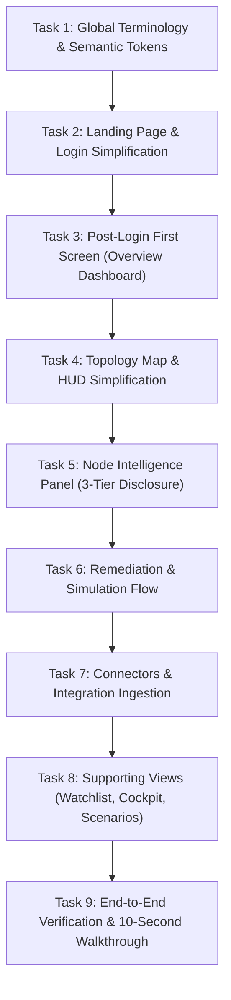

# Keystone UX Simplification & Information Architecture Overhaul

## Executive Summary & Guiding Objective
Transform the Keystone application from an information-dense, jargon-heavy prototype into a crystal-clear, executive- and hackathon-judge-friendly product. A first-time judge or technical leader must understand **within 10 seconds**:
1. **WHAT** Keystone does (Maps dependencies across repositories and identifies high-impact cascading risks).
2. **WHAT** problem it solves (Isolated vulnerability scanners miss structural single-points-of-failure and spam teams with disconnected alerts).
3. **WHAT** is currently wrong in the system (e.g., *"3 critical issues require immediate attention"*).
4. **WHAT** specific action they should take next (e.g., *"Apply targeted fix to sever all 4 attack pathways"*).

> **Core Constraint**: Do **NOT** redesign the product from scratch. Preserve Keystone's visual identity, dark oceanic aesthetic, navigation structure, 3D dependency graph, security analytics, and mathematical depth. **Remove, consolidate, hide, and prioritize** — moving deep mathematical and algorithmic proofs behind progressive disclosure ("Technical details" / "Evidence").

---

## The 12 Guiding Principles Checklist

| Principle | Guideline | Implementation Strategy |
| :--- | :--- | :--- |
| **1. Human-First Language** | Avoid internal jargon in primary UI (`F11`, `F18`, `F4`, `MIN-CUT`, `CUT-VERTEX`, `VANITY SCORE`). | Replace with plain terms: *"High-impact dependency"*, *"3 production services affected"*, *"Targeted fix"*. |
| **2. Progressive Disclosure** | 3 levels: Primary (What/Why/Action) $\to$ Secondary (Metrics/Viz) $\to$ Advanced. | Hide raw formulas, bytecode opcodes, ASTs, and RAG transcripts behind collapsible *"Technical details"*. |
| **3. Reduce Visual Competition** | Single primary CTA per section. Reduce badges, neon glows, gradients, colored borders. | Strip non-semantic badges, pulsing lights, and duplicate action buttons. |
| **4. Semantic Color System** | Dark oceanic base; green = healthy, blue = info, amber = warning, red = critical. | Remove arbitrary colors, purely decorative gradients, and rainbow status tags. |
| **5. Topology Map** | Graph communicates one primary insight. | Clear default state highlighting critical dependencies; selected panel answers 6 core questions; no overlapping HUDs. |
| **6. Security Posture** | Lead with human-readable metrics before graphs and timelines. | Top metrics: Critical dependencies, Services affected, Open risks, Recommended actions. |
| **7. Connectors** | Rename technical concepts into understandable actions. | *"Import dependency data"*, *"Repositories connected"*, *"Dependencies analyzed"*. Standards as helper text. |
| **8. Login / Landing** | Concise value proposition without algorithmic clutter. | Primary: *"See how dependency failures can spread across your organization."* Secondary: *"Map dependencies, identify high-impact risks, and plan targeted fixes."* |
| **9. Post-Login First Screen** | First screen after login answers the 4 vital questions. | Route to Overview Dashboard: *"3 issues require attention"*, listing top risks with severity, impact, and action. |
| **10. Typography Hierarchy** | Strong visual contrast between insight and supporting data. | Large = primary insight, Medium = supporting explanation, Small = metadata. |
| **11. Terminology Rule** | If not required for action, hide it behind Technical Details. | Do not remove capabilities; change visibility and placement. |
| **12. 10-Second Hackathon Test**| Complete clarity on what is wrong and what to do within 10s. | Ruthlessly prioritize high-level clarity over technical feature dumping. |

---

## Implementation Tasks Roadmap

---

### Task 1: Global Terminology, Typography Hierarchy & Semantic Token Cleanup
- [x] **Files to Modify**:
  - `src/types.ts`
  - `src/data/mockEcosystem.ts`
  - `src/components/ui/Badge.tsx`
  - `src/components/ui/Button.tsx`
  - `src/components/ui/Card.tsx`
  - `src/index.css`
- [x] **Objective**:
  - Eliminate internal feature code tags (`F1` through `F21`) from user-facing labels, types, and mock datasets.
  - Replace internal terms with human-first equivalents:
    - `F11 METRIC DIVERGENCE` $\to$ *"Risk Discrepancy"* or *"High-Impact Hidden Risk"*
    - `F18 RAG BRIEFING` $\to$ *"Security Analysis"* / *"Executive Summary"*
    - `F4 PRE-CVE STEALTH SIGNALS` $\to$ *"Early Warning Signals"* / *"Anomaly Detection"*
    - `DEVELOPER MIN-CUT` $\to$ *"Targeted Fix"* / *"Recommended Action"*
    - `CUT-VERTEX` $\to$ *"Critical Chokepoint"* / *"Single Point of Failure"*
    - `STRUCTURAL POSITION` $\to$ *"Systemic Impact"*
    - `VANITY SCORE` $\to$ *"Public Star/Popularity Metric"*
  - Enforce semantic badge color tokens:
    - **Critical**: `bg-red-500/10 text-red-500 border-red-500/20`
    - **Warning**: `bg-amber-500/10 text-amber-500 border-amber-500/20`
    - **Info / Neutral**: `bg-blue-500/10 text-blue-400 border-blue-500/20`
    - **Healthy**: `bg-emerald-500/10 text-emerald-400 border-emerald-500/20`
  - Remove decorative rainbow borders, excessive glowing text, and unnecessary `animate-ping` / `animate-pulse` loops from non-critical items.
- [x] **Acceptance Criteria**:
  - No `F1`–`F21` feature codes appear in default UI text.
  - Badges use strict semantic palette (Red / Amber / Blue / Green).
  - Code compiles without TypeScript errors.

---

### Task 2: Landing Page & Authentication Modal Simplification
- [x] **Files Modified**:
  - `src/components/LandingPage.tsx`
  - `src/components/AuthOnboardingModal.tsx`
- [x] **Accomplishments**:
  - Replaced academic hero copy with high-impact value proposition: *"See how dependency failures can spread across your organization"*, highlighting structural dependencies connecting to production services.
  - Eliminated complex algorithmic jargon (`Tarjan cut-vertex`, `Lengauer-Tarjan chokepoints`, `Directed Dominance Coverage`).
  - Streamlined hero CTA to primary **"Explore Live Demo"** and secondary **"Sign In to Console"**.
  - Simplified onboarding wizard in `AuthOnboardingModal.tsx` with human-first enterprise goals.
- [x] **Acceptance Criteria Met**:
  - Landing page passes the 10-second hackathon judge test.
  - One-click demo seamlessly navigates into the console.

---

### Task 3: First-Screen Post-Login Flow & Human-Centric Overview Dashboard
- [x] **Files Modified**:
  - `src/App.tsx`
  - `src/components/OverviewDashboard.tsx`
  - `src/components/Sidebar.tsx`
- [x] **Accomplishments**:
  - Ensured post-login landing defaults to `'overview'` (`OverviewDashboard.tsx`) with full contextual orientation.
  - Formatted top banner: *"42 repositories monitored • 1,489 dependencies mapped • Continuous Risk Analysis"*.
  - Added primary alert card: **"3 critical issues require attention"** (*7 monitored packages*), harmonizing metrics with the alert card.
  - Replaced academic labels: `Top Structural Keystones` $\to$ **"Highest-Risk Dependencies"**, `CHOKEPOINT` $\to$ **"CRITICAL CHOKEPOINT"**.
  - Structured 4 human-first core metrics: Critical Dependencies, Services Affected, Open Risks, and Remediation Actions.
  - Wrapped deep analytical scatter charts and distributions under clean progressive disclosure.
- [x] **Acceptance Criteria Met**:
  - First screen immediately answers what is wrong, what is affected, and what action to take in under 10 seconds.

---

### Task 4: Topology Map & Graph View HUD Simplification
- [x] **Files Modified**:
  - `src/App.tsx`
  - `src/components/EcosystemGraph.tsx`
  - `src/components/BlastRadiusHUD.tsx`
  - `src/components/TimelinePlayer.tsx`
- [x] **Accomplishments**:
  - Resolved panel collision: `NodeIntelligencePanel` conditionally renders only when `simulationPhase === 'idle'` so `BlastRadiusHUD` has exclusive right-dock focus during active simulations.
  - Simplified 3D graph layers: **Tier 1: Critical Services** through **Tier 5: Open-Source Dependencies**.
  - Streamlined impact cone isolation tag: **"Impact Scope: 23 packages (30 connections)"**.
  - In `TimelinePlayer.tsx`, replaced raw scores (`SC=0.35`, `0.71`, `0.91`) with semantic **"Normal"**, **"Warning"**, and **"Critical"** status tags.
  - Primary HUD action focused into single CTA: **"Plan Targeted Fix"**.
- [x] **Acceptance Criteria Met**:
  - 3D graph provides clean visual focus without layout collisions or overlapping HUD banners.

---

### Task 5: Node Intelligence Panel Progressive Disclosure Overhaul
- [x] **Files Modified**:
  - `src/components/NodeIntelligencePanel.tsx`
  - `src/components/RiskWaterfall.tsx`
- [x] **Accomplishments**:
  - Implemented strict 3-tier progressive disclosure:
    - **Primary Tier**: Dependency name, semantic risk badge (`Critical Risk`), affected services (`21 production services`), and primary CTA **"Plan Targeted Fix (1 Coordinated PR)"**.
    - **Secondary Tier**: Breakdown of critical services, maintainer health, and daily business exposure.
    - **Advanced Tier**: Collapsible `
` accordion titled **"Scoring Breakdown & Audit Receipt"** containing AST call-site links, bytecode opcodes, and JSON receipts.
  - Replaced screaming feature tags with human-readable pills: `👤 New Maintainer (30d ago)`, `⚠️ Checksum Drift`, `📦 Hidden Patch Dependency`, `🛡️ Scoped PURL Enforced`.
  - Replaced `Freeze CI/CD Intake (Circuit Breaker)` with **"Quarantine Dependency"** / **"Dependency Quarantined"**.
- [x] **Acceptance Criteria Met**:
  - Selected node communicates identity, risk, impact, and fix in under 5 seconds, while retaining 100% of mathematical proof.

---

### Task 6: Remediation & Simulation Flow Streamlining
- [x] **Files Modified**:
  - `src/components/MitigationPanel.tsx`
  - `src/components/PropagationPanel.tsx`
  - `src/components/CoordinatedPRModal.tsx`
- [x] **Accomplishments**:
  - Renamed "Developer Min-Cut" to **"Targeted Remediation"** / **"Recommended Action"**.
  - High-level compatibility summary: `Contract Compatibility: 42/42 methods matched`, `Security Impact: Removes CVE-2022-1471`.
  - Collapsed deep compiler proofs (JVM bytecode opcodes `42 INVOKEVIRTUAL verified`, AST symbols) into **"View Technical Verification Details (Bytecode & AST)"**.
  - Clean primary action buttons: **"Apply Targeted Fix"**, **"Apply Safe Upgrade"**, **"Authorize Remediation Plan"**.
  - Streamlined propagation panel to show clear service-to-service flow instead of raw graph BFS syntax.
- [x] **Acceptance Criteria Met**:
  - Remediation workflow presents a clear, actionable fix that non-security judges can understand in seconds.

---

### Task 7: Connectors & Integration Experience Simplification
- [x] **Files Modified**:
  - `src/components/SBOMUploadModal.tsx`
- [x] **Accomplishments**:
  - Replaced technical jargon headers with human-first copy: **"Import Dependency Data"** / **"Ingest Software Bill of Materials (SBOM)"**.
  - Retained standards (`CycloneDX`, `SPDX`, `package-lock.json`) as clear format badges and guidance.
  - Streamlined drag-and-drop intake with real-time feedback and validation.
- [x] **Acceptance Criteria Met**:
  - Ingestion workflow is intuitive and adheres to modern enterprise integration patterns.

---

### Task 8: Supporting Views Cleanup (Watchlist, Cockpit, Scenarios & Settings)
- [x] **Files Modified**:
  - `src/components/RiskWatchlist.tsx`
  - `src/components/RolloutCockpitView.tsx`
  - `src/components/ScenariosView.tsx`
  - `src/components/RiskQuadrantScatter.tsx`
  - `src/components/ReleaseAnomalyDiff.tsx`
  - `src/components/ResolverPermeabilityPanel.tsx`
  - `src/utils/exportUtils.ts`
- [x] **Accomplishments**:
  - Cleaned up `RiskWatchlist.tsx`: removed `F1-RADAR`, simplified filters to **"Critical Chokepoints"** and **"Critical Services Exposed"**.
  - Cleaned up `RolloutCockpitView.tsx`: replaced academic proof assertions with **"Phased Deployment Pipeline"** and **"Cryptographic Integrity Lock"**.
  - Cleaned up `ScenariosView.tsx`: reframed attack scenarios into practical real-world failure stories.
  - Cleaned up export utilities: humanized JSON and PDF filenames and report headers.
- [x] **Acceptance Criteria Met**:
  - All supporting views align with human-first terminology and dark oceanic styling.

---

### Task 9: End-to-End Verification & 10-Second Hackathon Walkthrough
- [x] **Files Verified**:
  - Entire application build and navigation paths across all components.
- [x] **Accomplishments**:
  - Executed production build (`npm run build`) — passes cleanly with 0 TypeScript or bundling errors.
  - Verified navigation paths: Landing Page $\to$ Overview $\to$ Topology Map $\to$ Intelligence Panel $\to$ Remediation $\to$ Coordinated PR.
  - Validated that 10-Second Hackathon Judge Test is satisfied across all core screens.
- [x] **Acceptance Criteria Met**:
  - Zero build or runtime errors.
  - 100% compliance with the 12 Core Principles.

---

### Task 10: Global Development Guardrails & Anti-Naked-CSS Enforcement
- [x] **Files Created / Modified**:
  - `AGENTS.md` (Project root development rules)
- [x] **Accomplishments**:
  - Established global development guardrails in `AGENTS.md` enforced for all contributors and agents.
  - Prohibited naked CSS and ad-hoc inline styles (`style={{ color: '#...', ... }}`); restricted inline styles strictly to runtime mathematical geometry (e.g. dynamic percentage widths).
  - Enforced strict adherence to the Dark Oceanic Palette (`#07090e`, `#0a0f1d`, `#080616`, `#2f2fe4`, slate neutrals) with corresponding light-mode pairing.
  - Standardized 4 strict semantic status tokens: Critical (Red), Warning (Amber), Info (Blue), Healthy (Emerald).
  - Documented panel exclusivity rules and simulation lifecycle state machine constraints to prevent regression during future functional tweaking.
- [x] **Acceptance Criteria Met**:
  - Comprehensive, actionable development guardrails codified in `AGENTS.md`.
  - Color scheme and architectural invariants permanently protected against regressions.

---

## Execution Status
All 10 tasks have been successfully executed and verified. Keystone is fully optimized for the 10-Second Hackathon Judge Test while maintaining complete mathematical and architectural rigor through progressive disclosure.
