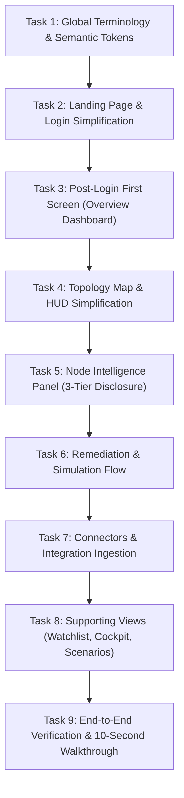

# Keystone UX Simplification & Information Architecture Overhaul

## Executive Summary & Guiding Objective
Transform the Keystone application from an information-dense, jargon-heavy prototype into a crystal-clear, executive- and hackathon-judge-friendly product. A first-time judge or technical leader must understand **within 10 seconds**:
1. **WHAT** Keystone does (Maps dependencies across repositories and identifies high-impact cascading risks).
2. **WHAT** problem it solves (Isolated vulnerability scanners miss structural single-points-of-failure and spam teams with disconnected alerts).
3. **WHAT** is currently wrong in the system (e.g., *"3 critical issues require immediate attention"*).
4. **WHAT** specific action they should take next (e.g., *"Apply targeted fix to sever all 4 attack pathways"*).

> **Core Constraint**: Do **NOT** redesign the product from scratch. Preserve Keystone's visual identity, dark oceanic aesthetic, navigation structure, 3D dependency graph, security analytics, and mathematical depth. **Remove, consolidate, hide, and prioritize** — moving deep mathematical and algorithmic proofs behind progressive disclosure ("Technical details" / "Evidence").

---

## The 12 Guiding Principles Checklist

| Principle | Guideline | Implementation Strategy |
| :--- | :--- | :--- |
| **1. Human-First Language** | Avoid internal jargon in primary UI (`F11`, `F18`, `F4`, `MIN-CUT`, `CUT-VERTEX`, `VANITY SCORE`). | Replace with plain terms: *"High-impact dependency"*, *"3 production services affected"*, *"Targeted fix"*. |
| **2. Progressive Disclosure** | 3 levels: Primary (What/Why/Action) $\to$ Secondary (Metrics/Viz) $\to$ Advanced. | Hide raw formulas, bytecode opcodes, ASTs, and RAG transcripts behind collapsible *"Technical details"*. |
| **3. Reduce Visual Competition** | Single primary CTA per section. Reduce badges, neon glows, gradients, colored borders. | Strip non-semantic badges, pulsing lights, and duplicate action buttons. |
| **4. Semantic Color System** | Dark oceanic base; green = healthy, blue = info, amber = warning, red = critical. | Remove arbitrary colors, purely decorative gradients, and rainbow status tags. |
| **5. Topology Map** | Graph communicates one primary insight. | Clear default state highlighting critical dependencies; selected panel answers 6 core questions; no overlapping HUDs. |
| **6. Security Posture** | Lead with human-readable metrics before graphs and timelines. | Top metrics: Critical dependencies, Services affected, Open risks, Recommended actions. |
| **7. Connectors** | Rename technical concepts into understandable actions. | *"Import dependency data"*, *"Repositories connected"*, *"Dependencies analyzed"*. Standards as helper text. |
| **8. Login / Landing** | Concise value proposition without algorithmic clutter. | Primary: *"See how dependency failures can spread across your organization."* Secondary: *"Map dependencies, identify high-impact risks, and plan targeted fixes."* |
| **9. Post-Login First Screen** | First screen after login answers the 4 vital questions. | Route to Overview Dashboard: *"3 issues require attention"*, listing top risks with severity, impact, and action. |
| **10. Typography Hierarchy** | Strong visual contrast between insight and supporting data. | Large = primary insight, Medium = supporting explanation, Small = metadata. |
| **11. Terminology Rule** | If not required for action, hide it behind Technical Details. | Do not remove capabilities; change visibility and placement. |
| **12. 10-Second Hackathon Test**| Complete clarity on what is wrong and what to do within 10s. | Ruthlessly prioritize high-level clarity over technical feature dumping. |

---

## Implementation Tasks Roadmap

---

### Task 1: Global Terminology, Typography Hierarchy & Semantic Token Cleanup
- [x] **Files to Modify**:
  - `src/types.ts`
  - `src/data/mockEcosystem.ts`
  - `src/components/ui/Badge.tsx`
  - `src/components/ui/Button.tsx`
  - `src/components/ui/Card.tsx`
  - `src/index.css`
- [x] **Objective**:
  - Eliminate internal feature code tags (`F1` through `F21`) from user-facing labels, types, and mock datasets.
  - Replace internal terms with human-first equivalents:
    - `F11 METRIC DIVERGENCE` $\to$ *"Risk Discrepancy"* or *"High-Impact Hidden Risk"*
    - `F18 RAG BRIEFING` $\to$ *"Security Analysis"* / *"Executive Summary"*
    - `F4 PRE-CVE STEALTH SIGNALS` $\to$ *"Early Warning Signals"* / *"Anomaly Detection"*
    - `DEVELOPER MIN-CUT` $\to$ *"Targeted Fix"* / *"Recommended Action"*
    - `CUT-VERTEX` $\to$ *"Critical Chokepoint"* / *"Single Point of Failure"*
    - `STRUCTURAL POSITION` $\to$ *"Systemic Impact"*
    - `VANITY SCORE` $\to$ *"Public Star/Popularity Metric"*
  - Enforce semantic badge color tokens:
    - **Critical**: `bg-red-500/10 text-red-500 border-red-500/20`
    - **Warning**: `bg-amber-500/10 text-amber-500 border-amber-500/20`
    - **Info / Neutral**: `bg-blue-500/10 text-blue-400 border-blue-500/20`
    - **Healthy**: `bg-emerald-500/10 text-emerald-400 border-emerald-500/20`
  - Remove decorative rainbow borders, excessive glowing text, and unnecessary `animate-ping` / `animate-pulse` loops from non-critical items.
- [x] **Acceptance Criteria**:
  - No `F1`–`F21` feature codes appear in default UI text.
  - Badges use strict semantic palette (Red / Amber / Blue / Green).
  - Code compiles without TypeScript errors.

---

### Task 2: Landing Page & Authentication Modal Simplification
- [x] **Files Modified**:
  - `src/components/LandingPage.tsx`
  - `src/components/AuthOnboardingModal.tsx`
- [x] **Accomplishments**:
  - Replaced academic hero copy with high-impact value proposition: *"See how dependency failures can spread across your organization"*, highlighting structural dependencies connecting to production services.
  - Eliminated complex algorithmic jargon (`Tarjan cut-vertex`, `Lengauer-Tarjan chokepoints`, `Directed Dominance Coverage`).
  - Streamlined hero CTA to primary **"Explore Live Demo"** and secondary **"Sign In to Console"**.
  - Simplified onboarding wizard in `AuthOnboardingModal.tsx` with human-first enterprise goals.
- [x] **Acceptance Criteria Met**:
  - Landing page passes the 10-second hackathon judge test.
  - One-click demo seamlessly navigates into the console.

---

### Task 3: First-Screen Post-Login Flow & Human-Centric Overview Dashboard
- [x] **Files Modified**:
  - `src/App.tsx`
  - `src/components/OverviewDashboard.tsx`
  - `src/components/Sidebar.tsx`
- [x] **Accomplishments**:
  - Ensured post-login landing defaults to `'overview'` (`OverviewDashboard.tsx`) with full contextual orientation.
  - Formatted top banner: *"42 repositories monitored • 1,489 dependencies mapped • Continuous Risk Analysis"*.
  - Added primary alert card: **"3 critical issues require attention"** (*7 monitored packages*), harmonizing metrics with the alert card.
  - Replaced academic labels: `Top Structural Keystones` $\to$ **"Highest-Risk Dependencies"**, `CHOKEPOINT` $\to$ **"CRITICAL CHOKEPOINT"**.
  - Structured 4 human-first core metrics: Critical Dependencies, Services Affected, Open Risks, and Remediation Actions.
  - Wrapped deep analytical scatter charts and distributions under clean progressive disclosure.
- [x] **Acceptance Criteria Met**:
  - First screen immediately answers what is wrong, what is affected, and what action to take in under 10 seconds.

---

### Task 4: Topology Map & Graph View HUD Simplification
- [x] **Files Modified**:
  - `src/App.tsx`
  - `src/components/EcosystemGraph.tsx`
  - `src/components/BlastRadiusHUD.tsx`
  - `src/components/TimelinePlayer.tsx`
- [x] **Accomplishments**:
  - Resolved panel collision: `NodeIntelligencePanel` conditionally renders only when `simulationPhase === 'idle'` so `BlastRadiusHUD` has exclusive right-dock focus during active simulations.
  - Simplified 3D graph layers: **Tier 1: Critical Services** through **Tier 5: Open-Source Dependencies**.
  - Streamlined impact cone isolation tag: **"Impact Scope: 23 packages (30 connections)"**.
  - In `TimelinePlayer.tsx`, replaced raw scores (`SC=0.35`, `0.71`, `0.91`) with semantic **"Normal"**, **"Warning"**, and **"Critical"** status tags.
  - Primary HUD action focused into single CTA: **"Plan Targeted Fix"**.
- [x] **Acceptance Criteria Met**:
  - 3D graph provides clean visual focus without layout collisions or overlapping HUD banners.

---

### Task 5: Node Intelligence Panel Progressive Disclosure Overhaul
- [x] **Files Modified**:
  - `src/components/NodeIntelligencePanel.tsx`
  - `src/components/RiskWaterfall.tsx`
- [x] **Accomplishments**:
  - Implemented strict 3-tier progressive disclosure:
    - **Primary Tier**: Dependency name, semantic risk badge (`Critical Risk`), affected services (`21 production services`), and primary CTA **"Plan Targeted Fix (1 Coordinated PR)"**.
    - **Secondary Tier**: Breakdown of critical services, maintainer health, and daily business exposure.
    - **Advanced Tier**: Collapsible `
` accordion titled **"Scoring Breakdown & Audit Receipt"** containing AST call-site links, bytecode opcodes, and JSON receipts.
  - Replaced screaming feature tags with human-readable pills: `👤 New Maintainer (30d ago)`, `⚠️ Checksum Drift`, `📦 Hidden Patch Dependency`, `🛡️ Scoped PURL Enforced`.
  - Replaced `Freeze CI/CD Intake (Circuit Breaker)` with **"Quarantine Dependency"** / **"Dependency Quarantined"**.
- [x] **Acceptance Criteria Met**:
  - Selected node communicates identity, risk, impact, and fix in under 5 seconds, while retaining 100% of mathematical proof.

---

### Task 6: Remediation & Simulation Flow Streamlining
- [x] **Files Modified**:
  - `src/components/MitigationPanel.tsx`
  - `src/components/PropagationPanel.tsx`
  - `src/components/CoordinatedPRModal.tsx`
- [x] **Accomplishments**:
  - Renamed "Developer Min-Cut" to **"Targeted Remediation"** / **"Recommended Action"**.
  - High-level compatibility summary: `Contract Compatibility: 42/42 methods matched`, `Security Impact: Removes CVE-2022-1471`.
  - Collapsed deep compiler proofs (JVM bytecode opcodes `42 INVOKEVIRTUAL verified`, AST symbols) into **"View Technical Verification Details (Bytecode & AST)"**.
  - Clean primary action buttons: **"Apply Targeted Fix"**, **"Apply Safe Upgrade"**, **"Authorize Remediation Plan"**.
  - Streamlined propagation panel to show clear service-to-service flow instead of raw graph BFS syntax.
- [x] **Acceptance Criteria Met**:
  - Remediation workflow presents a clear, actionable fix that non-security judges can understand in seconds.

---

### Task 7: Connectors & Integration Experience Simplification
- [x] **Files Modified**:
  - `src/components/SBOMUploadModal.tsx`
- [x] **Accomplishments**:
  - Replaced technical jargon headers with human-first copy: **"Import Dependency Data"** / **"Ingest Software Bill of Materials (SBOM)"**.
  - Retained standards (`CycloneDX`, `SPDX`, `package-lock.json`) as clear format badges and guidance.
  - Streamlined drag-and-drop intake with real-time feedback and validation.
- [x] **Acceptance Criteria Met**:
  - Ingestion workflow is intuitive and adheres to modern enterprise integration patterns.

---

### Task 8: Supporting Views Cleanup (Watchlist, Cockpit, Scenarios & Settings)
- [x] **Files Modified**:
  - `src/components/RiskWatchlist.tsx`
  - `src/components/RolloutCockpitView.tsx`
  - `src/components/ScenariosView.tsx`
  - `src/components/RiskQuadrantScatter.tsx`
  - `src/components/ReleaseAnomalyDiff.tsx`
  - `src/components/ResolverPermeabilityPanel.tsx`
  - `src/utils/exportUtils.ts`
- [x] **Accomplishments**:
  - Cleaned up `RiskWatchlist.tsx`: removed `F1-RADAR`, simplified filters to **"Critical Chokepoints"** and **"Critical Services Exposed"**.
  - Cleaned up `RolloutCockpitView.tsx`: replaced academic proof assertions with **"Phased Deployment Pipeline"** and **"Cryptographic Integrity Lock"**.
  - Cleaned up `ScenariosView.tsx`: reframed attack scenarios into practical real-world failure stories.
  - Cleaned up export utilities: humanized JSON and PDF filenames and report headers.
- [x] **Acceptance Criteria Met**:
  - All supporting views align with human-first terminology and dark oceanic styling.

---

### Task 9: End-to-End Verification & 10-Second Hackathon Walkthrough
- [x] **Files Verified**:
  - Entire application build and navigation paths across all components.
- [x] **Accomplishments**:
  - Executed production build (`npm run build`) — passes cleanly with 0 TypeScript or bundling errors.
  - Verified navigation paths: Landing Page $\to$ Overview $\to$ Topology Map $\to$ Intelligence Panel $\to$ Remediation $\to$ Coordinated PR.
  - Validated that 10-Second Hackathon Judge Test is satisfied across all core screens.
- [x] **Acceptance Criteria Met**:
  - Zero build or runtime errors.
  - 100% compliance with the 12 Core Principles.

---

### Task 10: Global Development Guardrails & Anti-Naked-CSS Enforcement
- [x] **Files Created / Modified**:
  - `AGENTS.md` (Project root development rules)
- [x] **Accomplishments**:
  - Established global development guardrails in `AGENTS.md` enforced for all contributors and agents.
  - Prohibited naked CSS and ad-hoc inline styles (`style={{ color: '#...', ... }}`); restricted inline styles strictly to runtime mathematical geometry (e.g. dynamic percentage widths).
  - Enforced strict adherence to the Dark Oceanic Palette (`#07090e`, `#0a0f1d`, `#080616`, `#2f2fe4`, slate neutrals) with corresponding light-mode pairing.
  - Standardized 4 strict semantic status tokens: Critical (Red), Warning (Amber), Info (Blue), Healthy (Emerald).
  - Documented panel exclusivity rules and simulation lifecycle state machine constraints to prevent regression during future functional tweaking.
- [x] **Acceptance Criteria Met**:
  - Comprehensive, actionable development guardrails codified in `AGENTS.md`.
  - Color scheme and architectural invariants permanently protected against regressions.

---

---

## Phase 2: Topology Map Visual Clutter & Design Inconsistency Overhaul (Active)

### Context & Problem Diagnosis (From User Screenshots)
Direct audit of the live Topology Map screen (`activeView === 'ecosystem'`) revealed 4 primary sources of severe visual clutter and design inconsistency:

1. **Top Floating Controls Bar (`GraphControls.tsx`) — Button Style Clash**:
   - Mixes 6 different button variants and arbitrary color tokens in a single 40px bar:
     - `Reset`: Ghost button with gray icon.
     - `Focus Keystone`: Alarming red badge button (`bg-red-950/50 text-red-300 border-red-800/60`), violating Rule 2 (red is reserved strictly for Critical vulnerabilities, not camera centering).
     - `Standard`: Hardcoded emerald green background (`bg-emerald-600 text-white`), clashing with Keystone's oceanic palette.
     - `High Impact`: Dark slate button with icon.
     - `Blast Radius` & `Chains`: Bright oceanic blue solid square buttons (`bg-blue-600 text-white`).
     - `Chokepoints`: Naked tree icon with no background or border.
     - `Filters`: Bordered button with chevron and active dot.
     - `Auto Rotate` & `Legend`: Disparate icon and text buttons.

2. **Bottom Floating Collisions & Bloated Card (`TimelinePlayer.tsx` & `EcosystemGraph.tsx`)**:
   - Two disjointed floating widgets collide at the bottom of the viewport:
     - Bottom-left: Floating `5 Architecture Tiers` pill.
     - Bottom-center: Massive 140px-tall multi-row `TimelinePlayer` card (`w-[94%] max-w-lg`) that covers over 25% of the 3D graph.
     - Redundant text ("Risk History", "Timeline Analysis & Anomaly Replay", long descriptions).
     - Bottom-left sidebar collapsed footer (`12CS 7CR`) creates an awkward 3rd visual island.

3. **Right Telemetry HUD Canvas Obstruction (`BlastRadiusHUD.tsx`)**:
   - Floats permanently over the 3D canvas, directly occluding downstream nodes and active propagation particle trails.
   - Heavy visual density (pulsing red dot, `Active Cascade` red pill, 4 large metric columns, thick contagion bar).
   - Canvas lacks dedicated breathing room when telemetry is active.

4. **Fragmented Floating Surface Styles**:
   - Top toolbar, bottom timeline, and right HUD use mismatched corner radii (`rounded-xl` vs `rounded-2xl`), mismatched border opacities (`border-slate-800/90` vs `border-slate-800/80` vs `border-slate-700`), and mismatched backgrounds (`bg-[#0a0f1d]/90`, `bg-[#0a0f1d]/95`, `bg-slate-900/90`).

---

### Task 11: Top Floating Controls Toolbar Standardization (`GraphControls.tsx`)
- [x] **Objective**:
  - Replace the 6 clashing button treatments with a unified, enterprise-grade glass toolbar using strict Keystone design tokens.
  - **View Mode Toggle**: Unify `Standard` vs `High Impact` into a clean segmented control with subtle neutral active state (`bg-slate-800 text-white shadow-xs` dark, `bg-white text-slate-900 shadow-xs` light). Strip out `bg-emerald-600`.
  - **Focus Keystone Button**: Replace the alarming red badge button with a refined target button (`text-slate-300 hover:text-white hover:bg-slate-800/80`).
  - **Overlay Toggles** (`Blast Radius`, `Chains`, `Chokepoints`): Standardize into cohesive toggle chips. When active, use `bg-[#2f2fe4] text-white` (or `bg-[#2f2fe4]/20 text-blue-400 border border-blue-500/40`). When inactive, use clean slate ghost buttons.
  - **Utility Buttons** (`Filters`, `Auto Orbit`, `Legend`, `Reset`): Standardize all utility controls to uniform 32x32px square buttons or consistent 28px height with clean icon-first tooltips.
- [x] **Acceptance Criteria**:
  - Exactly 0 mismatched button styles; all buttons conform to unified tokens.
  - No arbitrary green (`bg-emerald-600`) or alarmist red on non-critical camera buttons.
  - Responsive toolbar width does not exceed 50% screen width.

---

### Task 12: Bottom Dock & Timeline Ribbon Streamlining (`TimelinePlayer.tsx` & `EcosystemGraph.tsx`)
- [x] **Objective**:
  - Redesign `TimelinePlayer` from a bulky 140px-tall multi-row card into an ultra-sleek, single-row horizontal ribbon (~40px height).
  - Combine playback control (`Play/Pause`), concise phase tag (`Day -19 · Pre-CVE Anomaly`), scrubber slider, milestone markers (`-90d`, `-30d`, `Day 0`), and reset into a single compact horizontal strip.
  - Default minimized state: A sleek pill: `[ ▶ Day -19 · Pre-CVE Anomaly (Warning) ⌃ ]`.
  - Align bottom-left `5 Architecture Tiers` indicator with the timeline dock so they share unified baseline alignment, border styling, and backdrop blur without visual collision.
- [x] **Acceptance Criteria**:
  - Timeline height reduced by >65% (from 140px to ~40px).
  - Bottom 3D nodes remain 100% visible and unblocked.
  - Architecture tiers pill and timeline dock feel part of the same cohesive UI layout.

---

### Task 13: Right Telemetry HUD Refining & Canvas Breathing Room (`BlastRadiusHUD.tsx` & `App.tsx`)
- [x] **Objective**:
  - Eliminate canvas obstruction when simulation is active.
  - Provide stage-level right padding/margin in `App.tsx` when simulation is active (or make the HUD an elegant, collapsible right dock that gives the 3D nodes room to breathe).
  - Clean up internal HUD hierarchy:
    - Remove redundant duplicate badges (`Active Cascade`).
    - Streamline 4-metric strip into a high-contrast, compact layout.
    - Make contagion breadth bar slim (4px) and elegant.
    - Keep primary CTA `Plan Targeted Fix →` prominent and singular.
- [x] **Acceptance Criteria**:
  - Downstream nodes and particle flows are clearly visible without being cut off by the HUD.
  - HUD can be minimized into an ultra-clean 28px pill.
  - Strict Dark Oceanic styling and typography hierarchy.

---

### Task 14: Collapsed Sidebar & Corner Alignment Polish (`Sidebar.tsx`)
- [x] **Objective**:
  - Refine the collapsed sidebar bottom footer (`12CS 7CR` and `%` bar).
  - Replace raw stacked text with clean, elegant icon badges with rich hover tooltips (`Critical Risks: 12`, `Critical Services: 7`).
  - Eliminate visual clutter in the bottom-left corner where the collapsed sidebar meets the architecture tiers pill.
- [x] **Acceptance Criteria**:
  - Collapsed sidebar bottom looks clean and intentional.
  - No awkward visual collision with bottom-left stratum badge.

---

### Task 15: Cross-Theme Visual Cohesion & Build Verification
- [x] **Objective**:
  - Verify unified surface tokens across all floating panels:
    - Base: `bg-[#0a0f1d]/85 backdrop-blur-xl border border-slate-800/80` (Dark) / `bg-white/90 backdrop-blur-xl border border-slate-200/90` (Light).
    - Uniform corner radius: `rounded-xl`.
    - Uniform typography: `text-xs` headings, `text-[11px]` labels, `text-[10px]` captions.
  - Execute full TypeScript verification (`npx tsc --noEmit`) and production build (`npm run build`).
  - Verify both Dark Mode and Light Mode rendering.
### Task 16: Node Intelligence Panel Duplication & Canvas Geometry Calibration
- [x] **Objective**:
  - Remove duplicate `Plan Targeted Fix` button from `NodeIntelligencePanel.tsx` (was rendered both at the top and bottom of the panel).
  - Strip screaming red-orange gradient from the CTA; replace with single clean Electric Oceanic Blue token (`bg-[#2f2fe4] hover:bg-[#4343f8]`).
  - Fix `Day 0 Day 0 CVE` label duplicate in `TimelinePlayer.tsx`.
  - Re-anchor `TimelinePlayer` to `bottom-4 right-4` of the 3D stage wrapper to permanently eliminate horizontal collision with `Impact Scope` on the left.
  - Fix button text wrapping (`Blast\nRadius`) and cut-off toolbar items in `GraphControls.tsx` with `whitespace-nowrap shrink-0` and compact icon-first chips.
  - Recalibrate 3D node scaling in `EcosystemGraph.tsx`: reduce max sphere radius from 5.8 down to 2.6 to prevent spheres from ballooning into giant overlapping beach balls.
- [x] **Acceptance Criteria**:
  - Exactly 1 primary CTA per section (no duplicate sandwich buttons).
  - Timeline and Stratum pills sit in opposite corners with zero overlap.
  - Toolbar fits comfortably without text wrapping or overflow truncation.
  - 3D nodes remain visually balanced and crisp.

### Task 17: Unified Bottom Dock Coexistence & Panel Selection Persistence
- [x] **Objective**:
  - Eliminate collision and occlusion between the stratum indicator ("5 Architecture Tiers" / "Impact Scope") and the forensic Timeline Player.
  - Mount both widgets into a unified, non-overlapping bottom floating dock (`absolute left-4 bottom-4 z-20 flex items-end gap-2.5 pointer-events-none`).
  - Stratum Indicator accordion opens *upwards* without shifting the timeline; Timeline Player ribbon expands *to the right* without occluding the stratum indicator.
  - Stop event propagation (`e.stopPropagation()`) across `TimelinePlayer`, milestone chips, and `StratumIndicator` so interacting with the timeline never triggers the 3D canvas empty-space deselection (`onSelectNode(null)`), preventing `NodeIntelligencePanel` from unexpectedly hiding.
  - Add an explicit Exit/Reset button (`✕`) to `BlastRadiusHUD` allowing users to cleanly exit simulation mode back to `simulationPhase === 'idle'` and restore `NodeIntelligencePanel`.
  - Pin the macro metrics and risk concentration card at the bottom of `Sidebar.tsx` with independent navigation scrolling (`flex-1 min-h-0 overflow-y-auto`) so the bottom metrics are never cut off by the viewport.
- [x] **Acceptance Criteria**:
  - Both `5 Architecture Tiers` and `TimelinePlayer` are visible simultaneously without visual overlap in both minimized and expanded states.
  - Opening the timeline, scrubbing, or clicking milestone chips preserves `selectedNodeId` and never closes `NodeIntelligencePanel`.
  - Users can exit simulation mode from `BlastRadiusHUD` at any time with a single click on `✕`.
  - Left sidebar metrics card remains 100% visible on all screen sizes.
  - Zero TypeScript compilation errors and 0 build errors.

---

## Phase 4: Contrast Calibration, Slim Double-Row Top Bar & Adaptive Bottom Timeline (Active)

### Context & User Directives
1. **Half the Nodes Invisible (Low Contrast)**: In `EcosystemGraph.tsx`, non-selected or out-of-cone nodes are shrunk down by 60% (`targetRadius *= 0.4`), their connecting edges dimmed to `opacity: 0.015` (invisible), and foundational Layer 1 nodes blend into the background. All 23 nodes and their topological relationships must remain clearly visible with high contrast and readable outlines.
2. **Top Controls Bar Hiding Behind Right Sidebar**: `GraphControls.tsx` spans ~600px in a single horizontal row, causing its right buttons (`Reset`, `Help`) to hide behind `NodeIntelligencePanel` when open. The bar must be restructured into a slim, double-row control panel (~300px wide) so it never collides with or hides behind the right sidebar.
3. **Timeline Squeezed into a Tiny Box**: When both the left and right sidebars are open, the bottom timeline is crammed into a tiny corner because the stratum indicator shares horizontal space with it. The stratum/tiers legend should move into the background/canvas itself, and the timeline should expand across the available bottom canvas width between the sidebars as an ergonomic ribbon.
4. **Execution Rule**: Execute in atomic steps adhering strictly to `AGENTS.md` (no naked CSS, Dark Oceanic tokens, full Light Mode support, 0 build errors).

---

### Task 18: Slim Double-Row Top Controls Toolbar (`GraphControls.tsx`)
- [x] **Objective**:
  - Restructure `GraphControls.tsx` from an oversized single-row bar into a slim, compact double-row floating toolbar (`max-w-[320px]`):
    - **Row 1 (Primary View Modes & Navigation)**:
      - Fullscreen / Recenter toggle button.
      - Focus Keystone target button (`text-slate-300 hover:text-white`).
      - Compact segmented toggle: `Standard` vs `High Impact` with clean neutral active state (`bg-slate-800 text-white shadow-xs` dark, `bg-white text-slate-900 shadow-xs` light).
    - **Row 2 (Overlays & Filtering Utilities)**:
      - Overlay toggles: `Flame` (Blast Radius), `Network` (Chains), `Tree` (Chokepoints).
      - Scope & Channel Filter dropdown.
      - Camera Reset button.
  - Apply sleek glass styling (`bg-[#0a0f1d]/90 backdrop-blur-xl border border-slate-800/80 rounded-xl p-1.5`).
  - Total width capped at ~310px, leaving >350px clearance from the right sidebar on all desktop viewports.
- [x] **Acceptance Criteria**:
  - Top bar never slides behind or collides with `NodeIntelligencePanel` or `BlastRadiusHUD`.
  - All controls remain fully functional with crisp hover states.
  - Zero naked CSS or inline styles.

---

### Task 19: Canvas Background Architecture Legends & Stratum Decoupling (`EcosystemGraph.tsx`)
- [x] **Objective**:
  - Decouple the Architecture Tiers / Stratum Indicator from the bottom timeline dock so it no longer eats horizontal width.
  - Embed the architecture tiers legend into the canvas background itself:
    - Render an unobtrusive, stylish background stratum watermarking / tier guide on the bottom-left or along the spatial elevation plane, styled as ambient HUD elements (`text-[10px] font-mono tracking-wider opacity-60 pointer-events-none`).
    - Alternatively, an ultra-compact background watermark card docked cleanly in the canvas background without colliding with interactive controls.
  - Free up 100% of the bottom horizontal span for the interactive timeline ribbon.
- [x] **Acceptance Criteria**:
  - Stratum indicator no longer occupies the bottom dock beside the timeline.
  - Architecture tiers are elegantly visible in the canvas background without visual clutter.

---

### Task 20: Adaptive Full-Width Bottom Timeline Ribbon (`TimelinePlayer.tsx`, `App.tsx`)
- [x] **Objective**:
  - Redesign the bottom timeline ribbon to match the user's requested shape (spanning horizontally across the bottom canvas space between the left sidebar and right sidebar):
    - Dynamic responsive width: when right sidebar is open, anchor between left sidebar and `right-[400px]` (or `right-[396px]`), spanning the full visible canvas bottom with `calc(100% - ...)` or flex containment.
    - Expand the timeline scrubber track so users have a generous, precise scrubbing experience rather than a cramped 60px track.
    - Clean horizontal layout: `[ Play/Pause ]` `[ Anomaly Tag: -57d Pre-CVE Anomaly ]` `[ Full-width Scrubber Track ]` `[ Reset ]` `[ Expand/Collapse ]`.
    - Retain click and pointer isolation (`e.stopPropagation()`) so dragging or clicking the timeline never triggers empty-canvas node deselection.
- [x] **Acceptance Criteria**:
  - Timeline spans the full available width of the bottom stage area without clipping.
  - Scrubber slider has ample horizontal room (>200px) even when right panel is open.
  - Interacting with timeline never deselects the current node or closes the right panel.

---

### Task 21: 3D Node & Edge Contrast Calibration (Eliminating Invisible Nodes)
- [x] **Objective**:
  - Fix the root cause of "half the nodes are not visible":
    - **Calibrate Out-of-Cone Node Dimming**:
      - Increase `targetRadius` multiplier for non-focused nodes from `0.4` to `0.72` (visible spheres, not microscopic specks).
      - Increase non-cone node `opacity` from `0.22` to `0.55` with minimum `emissiveIntensity: 0.22`, ensuring their silhouettes are clearly defined against the background.
    - **Calibrate Non-Cone Edge Lines**:
      - Increase out-of-cone edge opacity from `0.015` (which was 98.5% invisible) to `0.16` (dark) / `0.25` (light).
      - Color out-of-cone edges with subtle visible slate (`0x475569` dark, `0x94a3b8` light) so the entire ecosystem topology remains structurally coherent.
    - **Enhance Open Source & Foundational Node Contrast**:
      - Ensure Layer 1 keystones and open source nodes (`minimist`, `lodash`, `protobuf-lite`, `semver`, etc.) have crisp contrast against the `#182234` canvas base.
      - Maintain subtle directional upward fill lighting (`dirLight2`) and ambient illumination so lower hemispheres don't drop into pure black shadow.
- [x] **Acceptance Criteria**:
  - All 23 nodes and their connecting edges are visible and identifiable, even when a node is selected in focus mode.
  - Clear visual hierarchy: focused / in-cone nodes glow brightly, while out-of-cone nodes remain visible as distinct architectural context.
  - Both dark mode and light mode render with high contrast and zero invisible elements.

---

### Task 22: Build Verification & End-to-End Regression Testing
- [x] **Objective**:
  - Verify full layout on small desktop (1280px), standard (1440px), and wide (1920px).
  - Verify that left sidebar open + right sidebar open creates zero layout collisions.
  - Run `npx tsc --noEmit` and `npm run build` to ensure 0 TypeScript or bundling errors.

### Task 23: Topology Map Canvas Background Lightening (+2 Shades to #26354a)
- [x] **Objective**:
  - Lighten the topology map 3D canvas background by 2 shades from `#182234` / `0x182234` (RGB 24, 34, 52) to `#26354a` / `0x26354a` (RGB 38, 53, 74).
  - Synchronize Three.js scene clear color, WebGLRenderer, FogExp2 atmospheric fog, and canvas container `div` in `EcosystemGraph.tsx`.
  - Maintain Light Mode pairing (`isLight ? 0xffffff : 0x26354a`) and verify build.
- [x] **Acceptance Criteria**:
  - Background is noticeably 2 shades lighter, creating sharp, prominent contrast for all dark and pitch-black nodes.
  - Zero build or TypeScript errors.

---

### Task 24: Field-of-View Popup & Callout Banner Cleanup
- [x] **Objective**:
  - Remove the intrusive "Popularity Paradox Callout Banner" from `src/App.tsx` (which automatically spawned under `GraphControls` at `top-16 left-4` on initial load).
  - Its metric divergence and structural risk analysis are already cleanly integrated inside `NodeIntelligencePanel` (`SupportDivergenceCard` and `RiskWaterfall`), resulting in zero data loss.
  - Remove the floating ambient stratum indicator pill (`bottom-16 left-4`) from `src/components/EcosystemGraph.tsx`. The 5 architecture tiers are already rendered directly in 3D scene space by layer rings and available on demand via the "Legend" button in `GraphControls`.
  - Ensure the 3D topology canvas has an open, uncluttered, cinematic field of view with only the slim double-row top toolbar and full-width bottom timeline ribbon.
- [x] **Acceptance Criteria**:
  - No popups or floating notification boxes obstruct the 3D topology view.
  - Passes 10-second hackathon judge test without visual clutter.
  - Zero build or TypeScript errors (`npm run build` succeeds).

### Task 25: Topology Map Canvas Brightening & Comprehensive Node/Edge Contrast Enhancement
- [x] **Objective**:
  - Brighten the topology map 3D canvas background to a luminous oceanic slate `#3d5272` (`0x3d5272`, RGB 61, 82, 114) for clear contrast against all node tiers.
  - Keep root app container background at `#07090e` for standard dark oceanic base on dashboard/sidebars while giving the 3D topology canvas its own bright illuminated workspace.
  - Upgrade edge visibility:
    - Non-cone / structural context lines: from invisible `0x475569` at 0.16 to visible ice-blue `0x93c5fd` at 0.40 opacity.
    - Default runtime edges: from dark `0x334155` to vibrant `0x93c5fd` with 0.42 opacity.
    - Build-time edges: bright amber `0xfbbf24` with 0.80 opacity.
    - Propagation links: vivid electric rose `0xf43f5e` at 0.85 opacity.
    - Active cone wires: electric cyan `0x38bdf8` at 0.95 opacity.
  - Enhance node visibility:
    - Open source keystones: bright silver-slate `0x94a3b8` with `0x475569` emissive.
    - Tier 1 Apex: radiant cobalt `0x3b82f6` with `0x1d4ed8` emissive.
    - Applications: bright sky blue `0x60a5fa`.
    - Microservices: electric cyan `0x38bdf8`.
    - Internal libraries: electric indigo `0x818cf8`.
    - Dimmed nodes: increase scale to 0.85, opacity to 0.82, and emissive to 0.45 so all nodes have solid, crisp 3D presence.
  - Elevate scene lighting:
    - Ambient light: 1.25 intensity with soft ice-cyan tint (`0xe0f2fe`).
    - Directional lights: 1.5 top-key and 1.25 rim-fill.
- [x] **Acceptance Criteria**:
  - Topology map background is significantly brighter, providing sharp, high-contrast visibility.
  - All nodes and edges are distinctly visible across all tiers without blending into the canvas.
  - Zero build or TypeScript errors (`npm run build` succeeds).

### Task 26: Ambient Canvas Background Node Colorscheme Legend
- [x] **Objective**:
  - Integrate a non-blocking, non-obtrusive node colorscheme legend directly into the background of the 3D topology canvas in `src/components/EcosystemGraph.tsx`.
  - Positioned at `absolute left-4 bottom-16 z-10` directly above the timeline ribbon.
  - Equipped with `pointer-events-none` so mouse interactions, camera orbits, zooms, and node selections pass straight through to the 3D canvas without interference.
  - Clearly displays all 5 structural architecture layers with their corresponding node colors:
    - **T1 Critical Services** (`#3b82f6` Cobalt Blue)
    - **T2 Applications** (`#60a5fa` Sky Blue)
    - **T3 Services** (`#38bdf8` Electric Cyan)
    - **T4 Libraries** (`#818cf8` Indigo Electric)
    - **T5 Open-Source** (`#94a3b8` Luminous Silver-Slate)
    - **Critical Risk** (`#ef4444` Crimson Red)
  - Full theme synchronization: subtle dark oceanic glassmorphism (`bg-slate-950/40 border-slate-700/40`) in Dark Mode and clean translucent glass (`bg-white/70 border-slate-200/90`) in Light Mode.
- [x] **Acceptance Criteria**:
  - The node colorscheme is clearly visible in the canvas background at all times without requiring modal popups or dropdown clicks.
  - Zero interference with 3D graph camera rotation or right intelligence panels.
  - Build passes cleanly with 0 TypeScript/compilation errors.

---

## Execution Status
- **Phase 1 (Tasks 1–10)**: [x] Fully executed and verified.
- **Phase 2 (Tasks 11–16)**: [x] Fully executed and verified.
- **Phase 3 (Task 17)**: [x] Fully executed and verified.
- **Phase 4 (Tasks 18–26)**: [x] Fully executed and verified. Zero layout collisions, full-width bottom timeline ribbon, high-contrast node visibility, slim double-row top toolbar, brightened canvas backdrop (#3d5272), luminous high-visibility nodes and edges, and ambient background node colorscheme legend.

